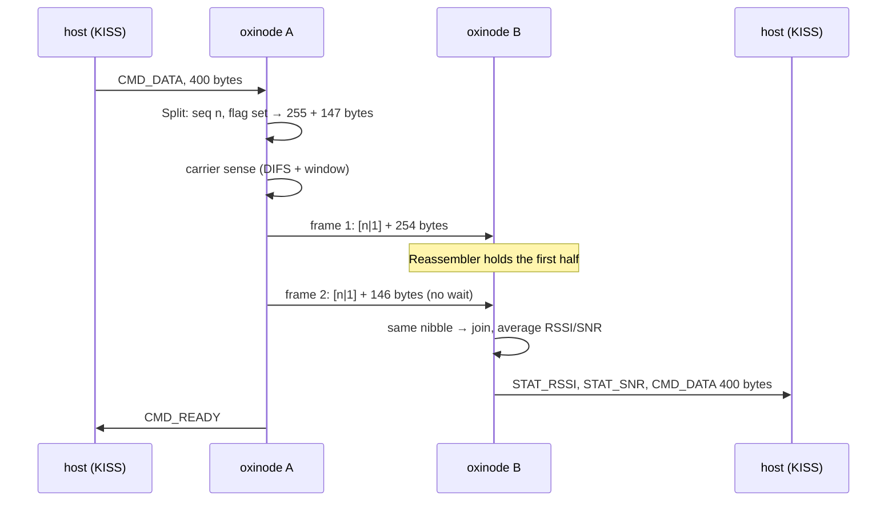
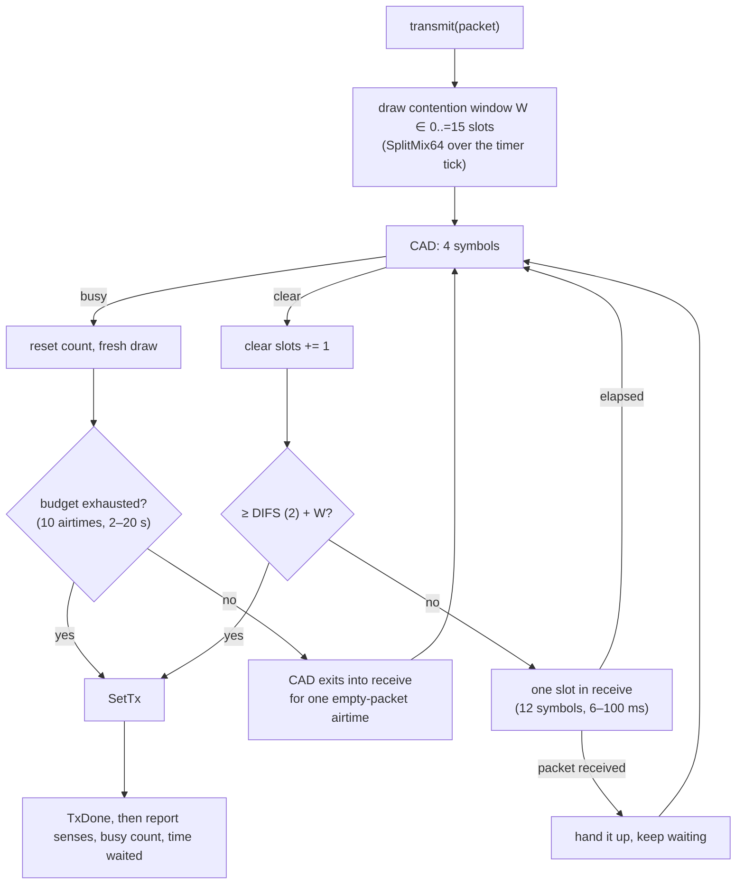

# On the air

What oxinode puts on the air is what a stock RNode puts on the air: one header
byte per LoRa frame, packets over 254 bytes split into two frames, and a
carrier-sense wait before every transmission. The frame layout and the
carrier-sense parameters are interface data, taken from the RNode firmware's
published constants and descriptions of its behaviour. Its code is GPL and
none of it was read, copied, ported or transliterated.

## The header, and the split at 255

`oxinode_core::rnode::air` holds no radio: packets in, frames out; frames in,
packets out. The chip-facing half is two call sites in the modem loop.

```
frame:  ┌────────────┬──────────────────────────────┐
        │ header (1) │ payload (0–254)              │
        └────────────┴──────────────────────────────┘
header: bit 7..4 sequence nibble · bits 3..1 zero · bit 0 split flag
```

- **A packet of up to 254 bytes** is one frame of up to 255, flag clear.
- **A longer packet** goes as two frames under the same header with the flag
  set: the first carries the first 254 bytes and is a full 255-byte frame, the
  second carries the rest. 508 bytes (Reticulum's `HW_MTU`, two frames of 254)
  is the most that goes; `Split::new` refuses 509, and the KISS decoder's
  capacity is `HW_MTU`, so a host cannot ask.
- **The second frame goes straight after the first**, with no carrier-sense
  wait between them. The receiver is holding the first half for it, and a
  stock RNode holds a half only until *any* other packet arrives, so a wait
  here would be a window for a neighbour to spoil the join. The channel read
  clear a moment ago, and a neighbour that sensed it heard this board's first
  frame.



**Reassembly** follows a stock receiver's rules. The receiver holds at most
one first half. A whole packet is handed up as it arrives and throws away any
half being held. A split frame with nothing held, or with a different nibble
held, is a new first half and replaces what was there. A split frame with the
same nibble held is the second half: the two are joined, handed up, and the
signal reported is the mean of the two frames'. A test writes a stock split of
a 300-byte packet out by hand (254 bytes, then 46, one header) so the split
point is pinned by the test rather than by the code under it.

Two deliberate departures, invisible to a receiver:

- **The sequence counts rather than being drawn at random.** A random nibble
  gives two consecutive split packets from one board the same nibble one time
  in sixteen, and a receiver that lost the second half of the first would join
  it to the first half of the second. `Sequence` steps from a seed drawn from
  the chip's ID, so consecutive packets never share a nibble.
- **A first half goes stale.** `Reassembler` holds it for two airtimes of a
  full frame plus a second (2.4 s at SF8/125 kHz, under a minute at SF12 and
  62.5 kHz), because the second half follows the first with nothing between
  them and one that has not come by then is not coming. A reconfiguration
  clears it outright.

The cost is one byte per frame (2.4 ms of airtime at SF8/125 kHz), and for a
packet over 254 bytes a second preamble and header, which it would have paid
anyway if it could have gone at all. The reassembler is 508 bytes of RAM and
one comparison per frame. Sixteen tests cover every length from 0 to 508,
missing halves in either order, out-of-order halves, and the nibble.

## Listening before transmitting

A LoRa radio is half duplex, and two boards that both have traffic will
collide unless one listens first. The decision is in
`oxinode_core::lr1121::csma`: it is fed one sense at a time and answers with
what to do next. The chip-facing half is in `Modem::transmit`.



**Slots** are twelve symbols, bounded to 6–100 ms, so a slot is a fraction of
a packet at any data rate rather than a number of milliseconds. **DIFS** is
two clear slots, then a further random window of up to fifteen. Any busy sense
starts the count over with a fresh draw, so two boards that both want the air
the moment it goes quiet draw different windows; one goes first and the other
hears it. **The draw** is SplitMix64's output function over the timer's tick
count, plus one per redraw: not a random number generator and not pretending
to be one, but two boards seeded from their own uptimes do not draw the same
window every time, and neighbouring seeds give unrelated draws. **A budget**
of ten airtimes of the packet being held, bounded to 2–20 s, after which the
packet goes regardless with the report saying so; the modem loop also serves
USB, Bluetooth and the panel, and a channel that reads busy for ten airtimes
running is more likely a detector fooled by noise than a neighbour with that
much to say.

**Sensing** is a LoRa channel activity detection: the chip correlates four
symbols against the modulation it is configured for (four rather than the
reference two, because this is asked to hear a packet already in progress and
not only a preamble) with Semtech's reference thresholds for the chip family.
`CadDetected` is not routed to the interrupt pin but is read from the pending
word.

**The wait is spent in receive**, so a packet that arrives during it is
received and handed up rather than transmitted over. Two chip settings make
that work: the receive timer stops on the *preamble* rather than the header
(`StopTimeoutOnPreamble`), so a packet that starts inside a slot is received
whole and the wait stretches to fit it; and a positive detection leaves the
chip in receive for the airtime of an empty packet rather than returning to
standby, so a detection made on a preamble catches the packet behind it. A
timer stopped on the preamble is a timer that never runs out on a false
preamble, so the listening windows also carry the chip's symbol timeout
(`SetLoRaSynchTimeout`, a slot plus the preamble plus a header plus a margin),
taken off again when the modem returns to continuous receive. A software
deadline remains as a backstop and reports busy rather than failing the
transmission.

A clear channel costs the DIFS and the window, two to seventeen slots with a
median of nine: about 220 ms before a packet at SF8/125 kHz and about 50 ms at
SF7/500 kHz. The report is in the log on every transmission:

```
tx: 131 bytes in 390228 us, after 13 senses (1 busy) and 294912 us waiting
```

### What is still lost

The sense cycle is a detection of about 10 ms followed by a slot of receive.
A packet that starts during the detection, or in the last few symbols of the
slot, is in the wrong place: the detection fires on its preamble and falls
into receive, but too little preamble remains for the receiver to sync on, and
every later sense finds data symbols the detector hears and the receiver
cannot decode. Something under half of the cycle is a window like that. Such a
packet is avoided rather than received: this board does not transmit over it,
but it does not hear it either. Two ways to close the gap, either its own
piece of work:

- **A longer preamble.** The stock firmware sends at least eighteen symbols
  and targets 24 ms of preamble; a receiver that starts listening a few
  symbols late still has enough to sync on. oxinode sends the eight the host
  asks for. Any receiver decodes a longer preamble than it expects, so this
  needs no agreement with the other end.
- **Sensing from inside receive.** Stay in continuous receive and sense with
  the chip's preamble and header interrupt bits and `GetRssiInst` against a
  noise floor, which is the stock firmware's carrier detect. No cycle, so no
  window; the price is the noise-floor estimate, and weak mid-packet signals
  below the threshold that CAD would have heard.

Not implemented from the stock arrangement: contention-window bands chosen by
measured channel utilisation, and the noise-floor estimate with an
interference threshold. The CAD thresholds are Semtech's reference values and
are untested at range.
