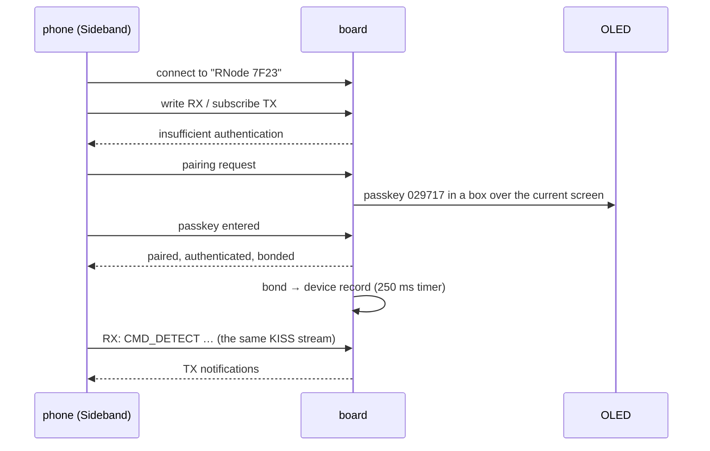

# Bluetooth

Bluetooth on an RNode is not a protocol of its own. It is a second pipe
carrying the identical KISS byte stream the USB serial port carries.
Reticulum's `RNodeInterface` and Sideband connect to a **Nordic UART Service**
peripheral and speak exactly what they would speak down a wire.

| | |
|---|---|
| Service | `6e400001-b5a3-f393-e0a9-e50e24dcca9e` |
| RX (host writes → board) | `6e400002-b5a3-f393-e0a9-e50e24dcca9e` |
| TX (board notifies → host) | `6e400003-b5a3-f393-e0a9-e50e24dcca9e` |
| Device name | `RNode XXXX`; the `RNode ` prefix is the discovery filter |
| Address | static random, derived from the chip's factory device address |
| MTU | negotiated up to 512, capped by the 512-byte attribute ceiling |

The interoperability constants and the MTU arithmetic are in
`core/src/ble.rs` with tests. The stack is in `src/ble.rs` and `src/nus.rs`.

The nRF52840 has no Bluetooth Classic, only LE, so this is a BLE RNode; in
Sideband **Hardware → RNode → "Device requires BLE"** must be ticked.

## The stack

`trouble-host` (the host stack) over `nrf-sdc` (Nordic's SoftDevice
Controller, a binary link-layer library) over `nrf-mpsl` (the Multiprotocol
Service Layer that owns the radio timing). The S140 SoftDevice that ships in
flash stays there, unused: oxinode keeps linking at `0x26000` and keeps the
bootloader.

`nrf-mpsl` 0.4 and `nrf-sdc` 0.4 both pin `embassy-nrf` 0.11 and
`embassy-sync` 0.8, and `trouble-host` 0.8 pins `embassy-time` 0.5, which is
what the rest of the workspace uses. Moving any of them moves all of them.

The controller is built for the peripheral role only; the central role is a
third of a megabyte of library that would never be called. One connection at
a time: a modem has a host, not an audience, and the board stops advertising
while a phone is connected.

### What the controller takes away

- **Peripherals:** `RTC0`, `TIMER0`, `TEMP`, `RADIO`, and PPI channels 17 to
  31. `embassy-time` runs on `RTC1`, so the clock everything else depends on
  is clear. The GPS UART uses `TIMER2` and PPI 10/11; the stall guard uses
  `TIMER1`.
- **Interrupt priorities:** MPSL sets `RADIO`, `RTC0` and `TIMER0` to `P0`
  and its own two to `P4`. It cannot lower anyone else's, and the NVIC's reset
  value is the same `P0`, so every other interrupt in the image is bound at a
  lower priority. Two interrupts at equal priority do not preempt each other,
  and a USB transfer left at `P0` would not interrupt the radio handler but
  *delay* it, which is worse.
- **The critical section.** See below.
- **`CLOCK_POWER`.** See below.

### The critical section

Exactly one `critical-section` implementation may be linked, and the two
builds need different ones. `cortex-m`'s single-core implementation masks
every interrupt, which is right for the images without Bluetooth and wrong
the moment MPSL is running, because the link layer keeps its timing on
`RADIO`, `RTC0` and `TIMER0`, and a critical section that stops those loses
connections. `nrf-mpsl` ships an implementation that masks everything except
those three. It would work in both builds, but it costs an NVIC mask save and
restore on every critical section, and `embassy-time` takes one per timer
operation, so the non-BLE images keep the cheap one.

That is why the Bluetooth build is a **separate feature set, not an extra
feature**, why `src/lib.rs` refuses a build that enables both, and why
`tools/test.sh` lints and builds each separately:

```bash
cargo build --release --no-default-features --features ble --bin rnode
```

### `CLOCK_POWER` is shared

`POWER` and `CLOCK` share one interrupt vector and one interrupt-enable word
on this part, with disjoint bits. When the bootloader starts the application
from DFU (every boot after a flash) its own USB stack has run, and it hands
over with `USBDETECTED`, `USBREMOVED` and `USBPWRRDY` still enabled, and
`USBPWRRDY` latched from the moment the regulator came up. After a press of
the reset button the same word reads zero.

An image that binds the vector to MPSL's clock handler alone, which knows
nothing about `POWER`, storms on that interrupt the instant `mpsl_init`
unmasks the vector: the line is high with nothing to lower it. MPSL puts that
interrupt at priority 7, so USB at priority 2 keeps answering the host while
everything in thread mode (the log, the touch, the executor) stops for good.
The handler was measured running 841 653 times in two seconds.

So there is one handler for the one vector, `oxinode::ble::PowerAndClockHandler`:
it services `POWER` (clears the USB events and folds them into a
`SoftwareVbusDetect`, which is what `embassy-usb` is designed to be fed by)
and then hands `CLOCK` to MPSL. `Vbus::take` clears the whole inherited
enable word before the vector is ever unmasked, and enables only the three
USB bits it will service.

## Pairing

Both characteristics demand an *authenticated* link. A write to RX or a
subscription to TX from an unpaired phone is refused with "insufficient
authentication", and every phone answers that by pairing. That is the only
trigger there is; a peripheral cannot demand pairing, it can only refuse to
talk until it has happened.

The board is `DisplayOnly`, so the method is Passkey Entry with LE Secure
Connections: the host stack generates six digits, the panel shows them in a
box over whatever screen it was on, the phone's user types them, and the link
is encrypted *and* authenticated, with MITM protection. "Just Works", which
anyone in range can do, would only get encryption, and an RNode's host is the
only thing allowed to key its radio. The stock firmware makes the same choice.
The P-256 arithmetic is pure Rust and is noticeable during pairing, which
happens once per phone.



Bonding is per connection and off by default in `trouble-host`;
`Connection::set_bondable(true)` before anything can start pairing is what
makes the keys survive the connection. Bonds are persisted in the device
record (four, oldest reused first) and reloaded at boot, because iOS keeps its
half of a bond the board has forgotten and then refuses the device until the
user deletes it by hand.

## Two transports, one modem

The modem loop is the one owner of the protocol and the radio, exactly as it
is for USB alone. Bluetooth is a pipe in each direction, pumped by
`oxinode::nus::pump`, with its own KISS decoder and its own outbox so a frame
in progress on one transport can never be spliced into a frame on the other.
The modem loop selects on the USB pipe, the Bluetooth pipe, and the radio's
interrupt.

A connected phone is the host. Answers to commands go back the way the
command came, so `rnodeconf` over USB works with a phone on the line;
unsolicited frames go to the phone while there is one, and to USB otherwise.
The modem loop never waits on the phone: its Bluetooth outbox drains with
`try_write`, and a phone that has gone gets its frames dropped and counted
rather than a modem that stops servicing the radio.

The Bluetooth screen shows the state (`absent`, `advertising`, `connected`),
the name, the passkey during a pairing, and the bond count; nothing about
Bluetooth is on the other screens' title bar. *Forget Phones* clears the stored bonds and raises a signal the
Bluetooth task answers between connections by removing every bond the host
stack holds; a phone connected at the time keeps its session and is forgotten
when it goes.

## Licensing

`nrf-sdc-sys` vendors Nordic's SoftDevice Controller as a binary archive under
`LicenseRef-Nordic-5-Clause`, which permits use on Nordic silicon. This is
Nordic silicon. It is the one part of oxinode that is not under the
[Reticulum License](../license.md) and neither is nor could be built from
source.
