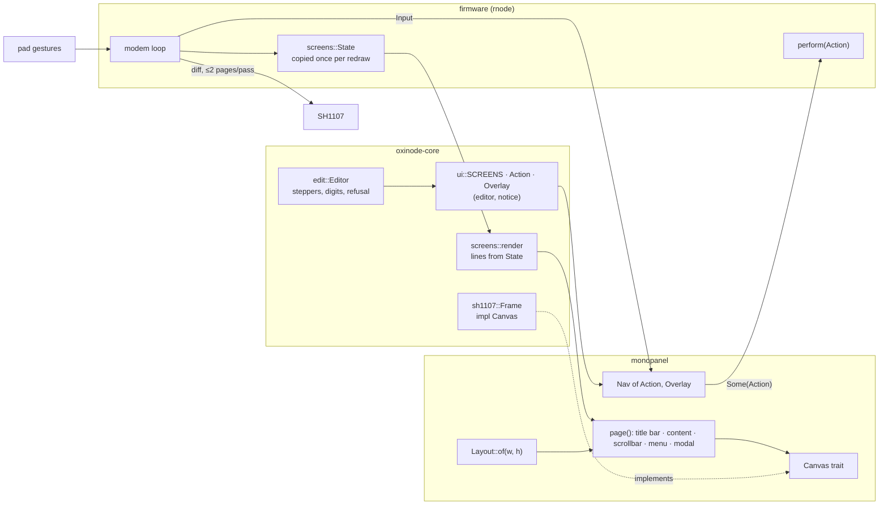

# The interface

Everything the panel shows is drawn by `monopanel`, a workspace crate under
`panel/` with nothing of oxinode in it. oxinode's own screens, menus, actions
and editor live in `oxinode-core` and consume the crate through its public
interface and no other way; the firmware supplies the values and carries out
the actions. The same render path runs on the board and in the simulator,
which is what makes every screen a host test and a golden image.

## `monopanel`

Five modules, no dependencies, `no_std`, `forbid(unsafe_code)`:

- **`canvas`**: the `Canvas` trait (width, height, set a pixel, with `fill`,
  `rect` and `frame_rect` provided on top so a canvas with a faster fill
  overrides one method) and `Readable`, a second smaller trait for tests and
  simulators, since plenty of displays cannot read a pixel back and none of
  the drawing needs to. `Bitmap` is a canvas of any size for tests.
- **`layout`**: `Layout::of(width, height)`, `const`. The bars are as tall as
  what they hold (the font and the icons) and the content gets what is left,
  so a shorter panel loses lines and nothing else and a narrower one loses
  characters. A test pins the 128 × 128 layout to the numbers the interface
  was first drawn with.
- **`nav`**: `Input`, `Item`, `Screen`, `Modal`, `Outcome`, `NoModal`, and
  `Nav<A, M>`. Screens are data the application supplies, a slice of
  descriptors (title, menu title, icon, menu), and the navigator is generic
  over the action type its menu items carry. It hands an action back from
  `handle` when the user picks one and never interprets it.
- **`draw`**: the title bar, the icon strip, the menu (windowed around its
  highlight when it does not fit), the scrollbar, and `page`, which composes
  them.
- **`font`**: the 5 × 7 font.

And one optional module, `eg`, behind the `embedded-graphics` feature, which
goes both ways round: `Target` makes any `Canvas` a `DrawTarget`, so the
ecosystem's primitives can be drawn onto a frame this interface owns, and
`Display` makes any monochrome `DrawTarget` a `Canvas`, so the interface can
be drawn onto any of the display drivers that speak `embedded-graphics`. A
`Canvas` cannot fail and a `DrawTarget` can, so `Display` keeps the last
error for its owner to look at rather than turning every `set_pixel` into a
`Result`. Both directions are tested, the second against
`embedded-graphics`'s own `MockDisplay`.

The crate has a README and a doctest showing a two-screen application in
thirty lines. It is `publish = false` under a name that is free on crates.io,
waiting for a second device.

## Three levels

1. **Screens**, side by side, moved between with left and right. Content is a
   list of text lines the application formats into its own buffers; `page`
   draws the ones that fit from the scroll position with a scrollbar when
   there are more.
2. **A menu** over each screen, opened with OK. Each item carries an action of
   the application's type, or `None` for an item that only closes the menu.
3. **A modal**, opened by the caller and not by a menu, that takes every key
   until it is done and keeps the screen's scroll under it. The navigator
   returns `Action::Edit(field)` from the menu, and the caller answers with
   `Nav::edit` or `Nav::notice`, because opening an editor needs the
   configuration to edit and only the caller knows whether a host has the
   line. The firmware's `perform` does it in six lines; the simulator's
   `Scene::press` does it in the same six.

## What oxinode supplies

**Screens** (`core/src/ui.rs`): the five descriptors, oxinode's `Action`
enum, and `Overlay`, its `Modal`, which is the editor or the notice. A
`NavExt` trait adds the five things oxinode asks of the navigator beyond what
the crate provides.

**Content** (`core/src/screens.rs`): what each screen is allowed to know. It
is handed a `State`, five small structs of plain values, and formats and
draws it. No protocol, no clock, no pin. The firmware copies the values out of
the modem loop once per redraw in one function; the simulator hands over a
fixture. A field that is not known is an `Option`, and `None` draws as a
dash; a test walks the empty state and refuses any line that ends in a number
where a dash belongs. A `label value` row is right-aligned by padding, because
the font is fixed-width and a column of values is what makes a page of
numbers readable. `Lines` records when a line was cut to fit, and every
screen, editor and notice asserts it was not.

**The editor** (`core/src/edit.rs`): an `Editor` opens on a copy of the whole
configuration and a field. Four fields are steppers over a fixed set,
saturating at the ends; a value not in the set (a bandwidth a host set) steps
onto the set in the direction pressed. Frequency is a digit editor, six
digits, with whatever the original had below a kilohertz kept unseen.
Confirming puts the candidate into the copy and asks `ValidConfig::new`, the
same function that decides whether a host's configuration may reach the chip;
a candidate that fails stays in the editor with the reason under it. The sets
are deliberately wider than what the radio accepts (power runs to 22 dBm,
bandwidth lists the ten LoRa bandwidths a host offers) so the refusal path is
reachable and tested. Cancel hands out nothing: the editor holds a copy and
confirm is the only thing that hands a value out.

**The protocol's side** (`Protocol::set_from_panel` and friends): the host's
setter without the reply. The setting lands unvalidated, as a host's does, and
if the radio is on it is reprogrammed through `ValidConfig` or refused with
the reason in `last_error` and the radio off. A test drives a host and a panel
to the same impossible power and asserts the two protocols end in the same
state.

## The host-ownership rule

An RNode is host-controlled. Reticulum's `RNodeInterface` validates its
configuration exactly once, when it brings the interface up; unsolicited
parameter frames afterwards update its bookkeeping and a debug line and
nothing else; and the only frame that makes it look again is an error, which
takes the interface down and brings it back up with the host's own
configuration over the top. So "edit freely and tell the host" does not exist,
and the rule is:

> **A live session on USB or Bluetooth owns the live radio configuration.**

A live session is DTR asserted on the KISS port, or a phone connected, the
same test the Home screen's `Host` row makes. It is deliberately not "the
host has turned the radio on": `rnodeconf` holds the port open without
touching the radio, and a host in the middle of `initRadio` has the port open
and the radio still off. The stricter test is never wrong about who is in
charge; its cost is that a terminal left open on the KISS port locks the
panel, which the notice says.

The rule is one function, `Action::changes_the_radio`, applied in one place
in the firmware, and the simulator's scene applies the same function so the
golden images of the notice are the board's behaviour. What it leaves the
panel free to do under a host is what the host does not own: *Save Config*,
*Forget Phones*, the screen, and the restarts.

Persistence follows the same rule. In TNC mode a panel edit goes into the
stored configuration as well as the live one; under host control nothing is
stored, because the host sets its configuration again on every connect. The
stored configuration is the `CONF_*` bytes of the EEPROM image that
`rnodeconf --tnc` writes; the panel did not need a second home for it.

## Redraw stays incremental

The modem loop's `Ui` holds two frames: `live`, which is what the controller
has been sent, and `scratch`, where the page is drawn. After every render,
`live.copy_from(&scratch)` marks only the pages whose bytes changed, and the
panel gets at most two of them per pass. A test pins that the same state
rendered twice dirties nothing, that a counter ticking dirties at most two
pages, and that a change between two short screens leaves the blank rows
clean. Nothing marks the whole panel dirty except the user, from the *Redraw*
menu item that exists for it.

## Two panel sizes

The interface renders on any canvas size, and the golden set is held at
128 × 128 (the board's) and 128 × 64. Getting the second size right is where
the layout's assumptions surfaced: a nine-item menu that does not fit is
windowed around its highlight; the pairing box is placed from the layout's
content area; and a `Down` is clamped by how many lines fit, which the
renderer tells the navigator at the same time it tells it how tall the content
is. A modal's lines are not scrolled, so on a four-line panel the refused
editor's reason is off the bottom; that is a fact about oxinode's content on a
panel oxinode does not have, and the right fix is content that fits.

The icon strip is centred and does not wrap; six or more screens on a
64-pixel-wide panel would run off it.

## Tests

The navigation tests that are about the model (wrapping, opening on `Back`,
sideways ignored under a menu, scroll clamping) are the crate's, run over a
fixture of three screens. The tests that are about oxinode (which actions a
host owns, that every field can be refused, that the notice closes on any key)
are in `oxinode-core`, run over the real screen set. The pixel assertions say
where nothing is drawn; the golden images say what it looks like. See
[The simulator](../development/simulator.md).
