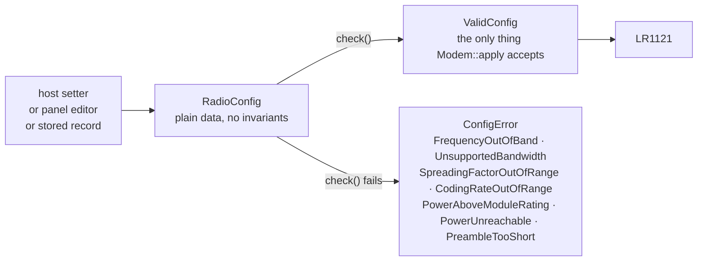
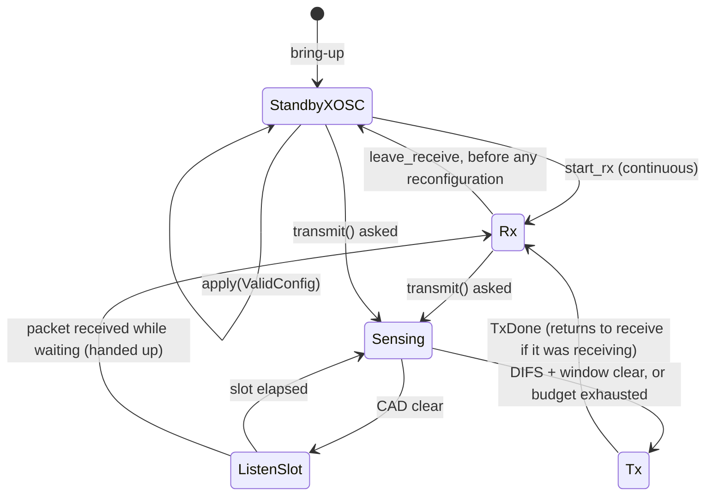

# The modem

`oxinode::modem::Modem` is the one place in the firmware that programs a
configuration into the LR1121, senses the channel, transmits and receives. It
takes a `ValidConfig` and nothing else, and everything it decides without the
chip is decided in `oxinode_core::lr1121`.

## Configuration

An RNode host sets five things, one at a time, in any order:

| | units on the wire |
|---|---|
| frequency | Hz |
| bandwidth | Hz |
| spreading factor | 7–12 |
| coding rate | 5–8, the denominator of 4/n |
| transmit power | dBm |

Two consequences shape the design. **Intermediate states are invalid and that
is normal**: a host moving from 915 to 868 MHz passes through a frequency
outside the band. Rejecting a *set* is wrong; refusing to *apply* an invalid
combination is right. And **the chip's units are not the wire's units**:
bandwidth is a code, coding rate is 1–4, and the commanded frequency is not
the wanted one. Every one of those conversions is somewhere a wrong answer
produces a radio that works perfectly at the wrong settings.

So there are two types in `oxinode_core::lr1121::config`:

`ValidConfig` can only be built by passing `check()`, so "did anybody validate
this?" is a question the compiler answers. `check()` names each limit
separately because a host on the far end of a serial line has nothing else to
go on. It deliberately does not check whether an RNode host could express the
configuration: SF5 and SF6 are outside the protocol's 7–12 and still valid at
the chip; `is_rnode_representable()` answers that other question.

Nothing clamps. A host asking for 22 dBm on a module rated for 20 is told
22 dBm and then simply does not get a radio: the state comes back off, the
host finds the mismatch, and the specific reason goes to the log port.

The same `ValidConfig` gate is applied to a host's request over KISS, to the
stored configuration when a TNC-mode board boots, and to a confirmed edit from
the panel.

## `apply`, `transmit`, `receive`

`apply` programs a configuration and always starts from standby: the LR1121
accepts its configuration commands only in standby, and from receive it
accepts them and reports `CMD_FAIL` on the next status read, so a modem that
did not leave receive first would keep the old settings while honestly
reporting the new ones. `SetPacketType` goes first and is not optional.

`transmit` loads the buffer, listens before it sends (see
[On the air](air.md)), issues `SetTx` from standby XOSC so the 5 ms oscillator
startup is not charged to the packet, waits for the interrupt line, and
checks that it was `TxDone` and not something else. A `WrongInterrupt` is
returned rather than a report, because that is precisely the case a bare
timeout on the interrupt line reports as success. The chip's own transmit
timeout is three airtimes, saturating at the field's 24-bit width.

`start_rx` puts the chip in continuous receive with no symbol timeout;
`receive` waits for the interrupt and reads the packet with its RSSI and SNR.
The chip holds one received packet in its buffer, so a packet arriving while
the modem loop is busy is not lost, but a second one behind it would be.

Every await is bounded and named. `lr11xx` waits on BUSY with no timeout, so a
command that leaves BUSY high hangs the driver, and `ModemError::Timeout`
carries which step expired. Every sequence ends by asking for a status,
because the chip returns the status of the previous command.

## The default

With no stored configuration and no host, the radio is off and the
configuration is 915.000 MHz, 125 kHz, SF8, 4/5, 14 dBm, 8 symbols of
preamble, sync word `0x12`, CRC on, explicit header, which comes to 3125 bps.
That bitrate is pinned by a host test, and it is the number Reticulum's own
arithmetic reports when it brings the interface up.

## Console

The `radio` image holds a `RadioConfig` instead of constants and lets every
field be cycled from a key, which is how a configuration is exercised on the
bench without a rebuild. See [Firmware images](images.md).
