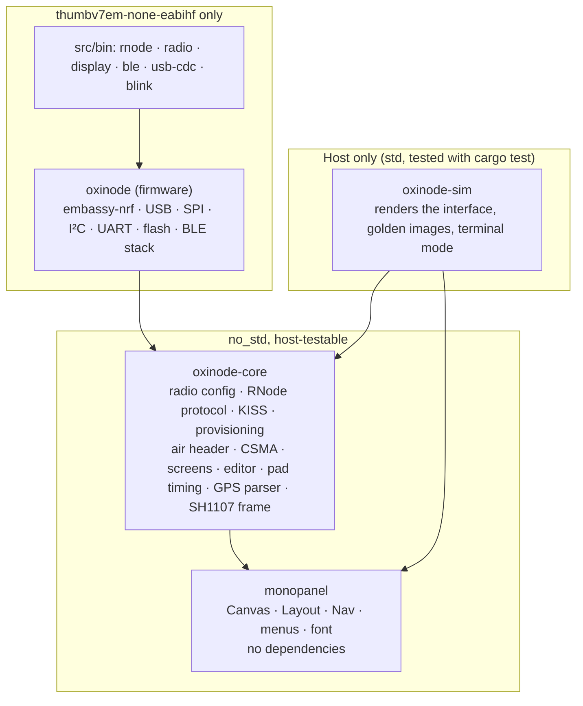
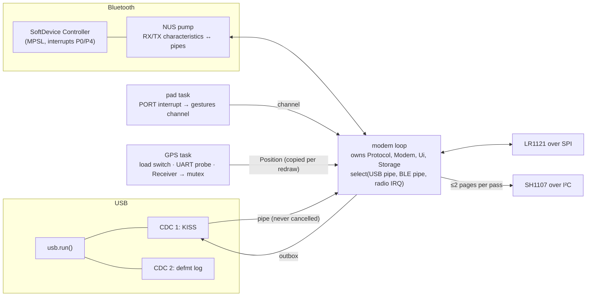
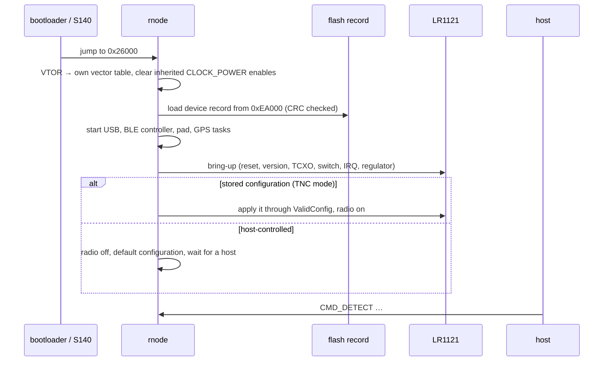

# Architecture overview

oxinode is a Cargo workspace of four crates split along one line: what needs
a board, and what does not.



| Crate | Path | Target | What is in it |
|---|---|---|---|
| `oxinode` | `src/` | Cortex-M only | The firmware: drivers, tasks, and the images in `src/bin/`. Depends on `embassy-nrf`, which only builds for the target, so it has no unit tests and never will. |
| `oxinode-core` | `core/` | `no_std`, builds anywhere | Everything decidable without a peripheral. Unit tested on the host; the bulk of the project's tests. Nothing here may depend on `embassy-*`, `cortex-m`, or any chip. |
| `monopanel` | `panel/` | `no_std`, no dependencies | The on-device interface as a crate with nothing of oxinode in it: a `Canvas` trait, a `Layout` derived from the canvas size, a navigator over application-supplied screens, menus, a font, and an optional `embedded-graphics` adapter. |
| `oxinode-sim` | `sim/` | host only | The panel simulator: any screen to a PNG, the menus in a terminal, and the golden-image regression set. |

The rule that produces the split: the firmware crate cannot be tested (no
`std`, no probe, no harness), so anything worth testing is arranged to be
testable somewhere else. The protocol state machine takes commands and
returns responses and at most one radio action; the screens take a struct of
plain values and draw; the pad takes a level and a time and returns gestures;
the carrier-sense logic takes one sense result and answers with what to do
next. The firmware is what feeds them.

## The product image

`rnode` is one Embassy executor running a handful of cooperating tasks.



The modem loop is the one owner of the protocol and the radio. Every other
task is a place bytes or gestures come from or go to:

- **USB** is two CDC-ACM functions. The KISS port's reads go through a pipe
  because a USB `read_packet` must never be cancelled (a `select` that drops
  it loses whatever it had taken from the endpoint), and the modem loop
  selects on everything.
- **Bluetooth** is a second pipe carrying the identical KISS stream, with its
  own decoder and outbox so a frame in progress on one transport can never be
  spliced into a frame on the other. The modem loop never waits on the phone:
  its Bluetooth outbox drains with `try_write` and a phone that has gone gets
  its frames dropped and counted.
- **The pad** and **the GPS** each have a task; they meet the modem loop at a
  channel and a mutex respectively.
- **The panel** is drawn by the modem loop into a scratch frame, diffed
  against what the controller was last sent, and flushed two pages at a time.

Who gets a frame nobody asked for (a received packet, a modem error) is one
rule: **a connected phone is the host.** Answers to commands always go back
the way the command came; unsolicited frames go to the phone while there is
one, and to USB otherwise. The rule is one function in `oxinode-core`
(`rnode::hosts`), asked by both paths a heard packet can come up: the idle
receive, and the carrier-sense wait before a transmission.

## Boot



The radio bring-up waits for USB enumeration or two seconds, whichever comes
first. Starting the 191 ms LR1121 reset concurrently with enumeration left the
board answering its first control transfers and then going quiet; the timeout
is what keeps a board on battery with no host bringing its radio up anyway.

## Where things are

```
memory.x                flash/RAM layout; the single source of truth for the load address
build.rs                installs memory.x and re-exports its FLASH origin and end to Rust
src/lib.rs              firmware crate root; the panic handler (reboots into the bootloader)
src/board.rs            board facts: clocks, LED polarity, UICR readback
src/boot.rs             VTOR relocation, reboot-into-bootloader
src/bringup.rs          the radio bring-up sequence
src/radio.rs            the SPI link to the LR1121, the raw version probe, the interrupt line
src/modem.rs            the one place that programs a configuration, senses, transmits and receives
src/usb_log.rs          defmt over the second CDC port
src/store.rs            the device record, in the flash a reflash cannot reach
src/display.rs          the I²C bus, the 12 V rail, and the panel transport
src/pad.rs              the pad driver: six pins, the PORT interrupt, the channel; the mode switch
src/gps.rs              the GPS task: load switch, UART probe, receiver
src/ble.rs              MPSL, the SoftDevice Controller, the shared CLOCK_POWER handler, the stall capture
src/nus.rs              the Nordic UART Service and its pumps
src/bin/                the images; see Firmware images
core/src/lr1121/        config and validation, chip encodings, reference correction, PA, airtime, CSMA
core/src/rnode/         KISS, the command set, the protocol state machine, the EEPROM image,
                        the device record, the air header and split, the display protocol, the outbox
core/src/hash/          MD5 (the EEPROM checksum is one) and SHA-256 (the device hash)
core/src/ui.rs          oxinode's screens, menus, actions, and its editor as the crate's modal
core/src/screens.rs     what each screen knows, and the lines it draws from that
core/src/edit.rs        editing one radio parameter: the steppers, the digits, the refusal
core/src/pad.rs         the pad as a state machine: debounce, auto-repeat
core/src/gps.rs         NMEA framing and parsing, the receiver's state, the on/off rule
core/src/sh1107.rs      the controller's commands and framebuffer, and its Canvas
core/src/battery.rs     the divider and the SAADC arithmetic, the percentage table
core/src/ble.rs         the NUS interoperability constants and MTU arithmetic
core/src/linker_script.rs  the memory.x parser build.rs uses
panel/src/              monopanel: canvas, layout, nav, draw, font, and the optional eg adapter
sim/src/                oxinode-sim: panel, image, script, scene, golden, text, tty
sim/golden/             the committed images, at 128 × 128 and under 128x64/
tools/                  flashing, packaging, layout checks, and their tests
.github/workflows/      ci on every push, docs on every push, release on every v* tag
```

## Principles that show up everywhere

**Refuse, do not clamp.** A host that asks for 21 dBm on a module rated for
20 is told no. A silent clamp is a lie the host cannot detect, and Reticulum
refuses an interface whose read-back differs from what it set in any case.
The same validation applies to a host's request, a stored configuration at
boot, and an edit from the panel.

**Bounded everywhere.** Every wait on the chip has a timeout that names which
step expired, because on a board with no probe a hang and a crash look the
same. Every sequence ends by reading a status, because the chip reports the
status of the previous command.

**Say "unknown", never a plausible zero.** A field the board does not know is
an `Option`, and `None` draws as a dash. The empty state has its own golden
images.

**Pure where it can be.** Decisions live in the core as functions of values;
the firmware supplies the values and carries out the result. Every such
function has tests, and the firmware's job is to be thin enough to be right
by inspection.

**Nothing from the GPL reference firmware.** The RNode protocol is taken from
Reticulum's host side (its `RNodeInterface` and `rnodeconf`), which is the
implementation oxinode has to satisfy, and every constant carries a note
saying which host behaviour pins it. The air format and carrier-sense
parameters are interface data taken from published constants and described
behaviour. See [License](../license.md).
