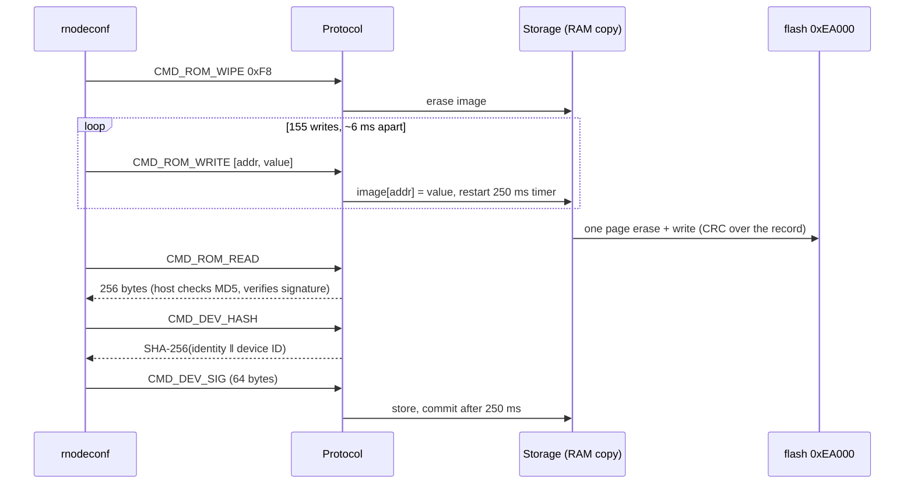

# Provisioning and storage

`rnodeconf` gives an RNode an identity, a signature, and a configuration it
remembers. oxinode stores all three, plus its Bluetooth bonds, in a device
record in the flash the bootloader reserves and never touches, so provisioning
survives a reflash.

## What a provisioned RNode is

A 256-byte EEPROM image, as `rnodeconf`'s `ROM` class defines it:

| Bytes | What |
|---|---|
| `0x00`–`0x0A` | product, model, hardware revision, 4-byte serial, 4-byte manufacture time |
| `0x0B`–`0x1A` | **MD5** of those eleven bytes |
| `0x1B`–`0x9A` | **RSA signature** over that MD5, 128 bytes |
| `0x9B` | lock byte `0x73`, written **last** |
| `0x9C`–`0xA7` | the stored radio configuration, with its own validity byte |

The host reads it, recomputes the MD5, verifies the signature against the
vendor keys plus any local signing key, and reports the device as unverified
if none match. The device cannot verify any of that (the keys are on the
host); what it has to do is store the image faithfully and mean the same
thing by "provisioned" as the host does. So `Eeprom::status` checks the
checksum too, which is why there is an MD5 in `oxinode-core`.

`CMD_ROM_WRITE` carries a one-byte address, so 256 is the whole addressable
space and `Eeprom::read` and `write` are total; a test walks all 256.

### Identity

The board says it is a **homebrew RNode**: product `0xf0`, model `0xff`,
board `0x32`. That is the honest answer and the safe one: for an nRF52 with
model `0xff` and a board that is not a RAK4631, `rnodeconf --update` refuses
with *No firmware found for this board* rather than offering to flash a
RAK4631 image onto an LR1121. The cost is that `rnodeconf -i` prints the band
and power from its own table for model `0xff`.

### The device hash

`CMD_DEV_HASH` is the one thing here no host pins: `rnodeconf --sign` asks the
device for thirty-two bytes, signs whatever it is given, and hands the
signature back to be stored. oxinode's definition is SHA-256 over the identity
block **and the MCU's factory device ID**: the provisioning and the physical
chip. Two people provisioning their own boards with their own `rnodeconf`
counters both get serial number 1, and the device ID is what stops a signature
made for one from validating the other. It is answered only when the device
is provisioned; an unprovisioned board that answered would let a signature be
made over erased bytes.

## The device record

```
0xEA000 ┌──────────────────────────────────────────┐
        │ magic "OXN1" · version 2 · length        │
        │ EEPROM image (256 bytes)                 │
        │ target firmware hash (32 bytes)          │
        │ bonds: count + up to 4 × (address, keys) │
        │ CRC-32 over everything above             │
        └──────────────────────────────────────────┘
```

`0xEA000` is the first page of the 40 KB the bootloader reserves with
`DFU_APP_DATA_RESERVED` and refuses to write through on both of its flashing
paths. The address is derived, not written twice: `build.rs` exports
`APP_FLASH_END` from `memory.x`. See [Memory layout](../hardware/memory-layout.md).

**The record has a checksum, and the reason is the radio.** Flash writes are
not atomic. For the identity block a torn record would be survivable, since
the host's own MD5 would catch it. For the stored radio configuration it
would not: a torn record can leave a plausible frequency, and a device in TNC
mode brings its radio up from that at boot with nobody watching. So the
record carries a CRC-32 and a record that fails it is discarded rather than
partially trusted. A test flips every byte of a record in turn and asserts
none of them decode. A version 1 record (no bonds) still decodes.

**Writes are debounced, not committed.** `rnodeconf` provisions with 155
single-byte writes six milliseconds apart, and a page erase stalls this CPU
for about 85 ms. Committing each one would need thirteen seconds to absorb one
second of commands. So `Action::Persist` means "eventually": the image is held
in RAM, the timer restarts on every write, and one commit follows 250 ms
after the last. The whole burst costs one erase. A 1200-baud touch and
`CMD_RESET` also force a commit, since a reflash is when losing a
provisioning would be least welcome and the host looks at the result after a
reset.



## TNC mode

A device with a stored configuration comes up on air by itself; that is what
`rnodeconf --tnc` asks for and the only reason to store a configuration. The
stored values go through **the same validation as anything a host sends**,
because they were written by a tool that does not know what this radio can
do. A configuration that does not validate leaves the radio off with the
reason in the log, exactly as an impossible request from a host would. A reset
takes about 420 ms to reach a configured radio with no host attached.

From the panel, *Save Config* stores the live configuration and makes the
board a TNC; in TNC mode a confirmed panel edit goes into the stored
configuration too. See [The interface](interface.md).

## Bluetooth bonds

Up to four bonds are kept in the record, oldest reused first, written on the
same 250 ms timer and reloaded into the host stack at boot. iOS keeps its half
of a bond the board has forgotten and then refuses the device until the user
deletes it by hand, which is why they are persisted. *Forget Phones* on the
Bluetooth screen clears them. See [Bluetooth](bluetooth.md).

## Flash writes and the Bluetooth controller

Erasing a page of the nRF52840's flash stalls the CPU for about 85 ms, and the
Bluetooth controller cannot hold a connection through that. So while the
controller is up the record is not written with the NVMC directly: it goes
through the controller's own flash scheduler (`nrf_mpsl::Flash`), which erases
the page in 10 ms partial slices and writes a few words at a time, each inside
a timeslot the controller fits between its radio events. A provisioning run,
or a bond being stored, leaves a connected phone connected. The write takes
longer end to end -- a few hundred milliseconds with a connection up -- and a
timeslot the scheduler could not fit comes back as an error rather than a
stall, which the firmware answers by starting the write over, up to four
times.

The two paths sit behind one trait in the firmware's `store` module. The
record's layout and the decision *what* to write stay in `oxinode-core`, which
is host-tested; only the last step differs. An image without a controller, or
the product image on a boot where the controller failed to start, drives the
NVMC directly, which stalls the CPU but has nothing left to stall. The boot log
says which: `writes via mpsl` or `writes via nvmc`.

The write is awaited to completion by the modem loop that owns the record, so
bytes that arrive while it is in flight wait in the pipe rather than restart
the 250 ms timer, and a reset requested by the host does not happen until the
record has landed.
