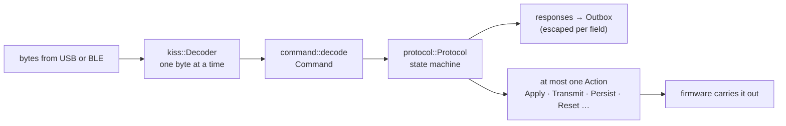
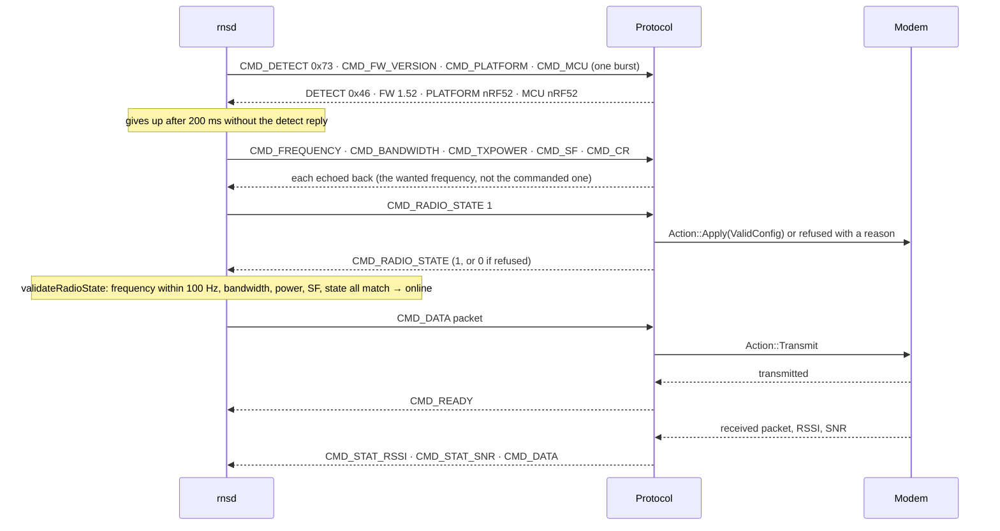

# The RNode protocol

An RNode speaks a KISS-framed command set down a serial port. oxinode
implements it in `oxinode_core::rnode`, with no hardware anywhere near it, so
the whole of a host's conversation can be tested on the host in microseconds.

## Where the definition comes from

Not from the reference firmware, which is GPLv3 and is not read, ported or
transliterated. The protocol is taken from the **host** side: Reticulum's
`RNS/Interfaces/RNodeInterface.py` and `RNS/Utilities/rnodeconf.py`, RNS
1.5.0. That is the right source for three reasons: it is the implementation
oxinode actually has to satisfy, so it is the specification in the only sense
that matters; it is a counterpart rather than a competing implementation of
the same side, so reading it is interoperability work; and what is extracted
(command bytes, field widths, byte order) is factual interface data. Every
constant in `oxinode_core::rnode::command` carries a note saying which host
behaviour pins it, and the tests are written as "what would the host make of
this?".

## Layers

### KISS framing

`0xC0` ends a frame; inside one, `0xC0` becomes `0xDB 0xDC` and `0xDB`
becomes `0xDB 0xDD`. The decoder takes one byte at a time because that is how
bytes arrive: USB delivers 64-byte packets with no relationship to frame
boundaries. It has to survive a hostile stream, since the port is open to
whatever is sent down it:

- an overlong frame is dropped whole, because a truncated frame is a
  well-formed frame with the wrong contents;
- a frame delimiter resynchronises from any state, so a lost byte costs one
  frame rather than the link;
- an empty frame is padding, not a frame. The host writes its four detect
  commands in one burst, so each frame's closing delimiter is the next one's
  opener, and a decoder that reported empty frames would answer four commands
  with five.

### The escaping is not uniform

The host only un-escapes some frames. Its parser has one branch per command.
Multi-byte fields (data, frequency, bandwidth, firmware version, counters,
airtime limits, statistics) accumulate through an unescaping step.
Single-byte fields (TX power, spreading factor, coding rate, radio state,
lock, RSSI, SNR, errors) are read raw, straight out of the stream. Escaping a
single-byte field corrupts it: the host takes `0xDB` as the value and then the
escape's second byte as the value again, and the last one wins.

It cannot bite on TX power or spreading factor, whose values are small. It
bites on SNR, which is signed: `0xDB` is −9.25 dB, an ordinary reading. So
`host_unescapes` is a transcribed table of both hosts' parsers (with a test
that the two agree wherever they overlap), and `encode_response` is the single
place that consults it. One value is unrepresentable in a raw single-byte
field: `0xC0` would end the frame. For SNR that is −16 dB, below the
demodulation floor at every spreading factor, so it is clamped, deliberately,
with a test that says so.

915 MHz big-endian is `36 89 CA C0`: the first thing a US host configures is
a frame that must be escaped, which is a better place to have got escaping
wrong than some rare packet months later.

### The command set

See [RNode commands](../reference/commands.md) for the table. Three things
about it that are not obvious from outside:

**The firmware version is a gate, not a label.** `validate_firmware` on the
host calls `RNS.panic()`, ending the host process, unless the reported version
is at least 1.52. oxinode reports 1.52: a statement that it speaks what a 1.52
RNode speaks, with a compile-time assertion against the requirement. oxinode's
own version is on the System screen.

**Two commands need a confirm byte.** `CMD_ROM_WIPE` and `CMD_RESET` are
checked for `0xF8`, as `rnodeconf` sends, because they are the only two
commands on the link that cannot be undone and the port is open to stray
bytes.

**Three kinds of "no".** A command for hardware this board does not have
(WiFi, a neopixel) is `NotApplicable`; one that is understood and not
implemented (display blanking, rotation, `CMD_BLINK`, `CMD_BT_CTRL`,
`CMD_BT_PIN`) is `NotYetImplemented`; a byte the firmware does not know is
`Unknown`; and a known command with an impossible payload is `Malformed`,
which is the interesting one, since it means the host and the firmware
disagree about a command they both claim to know.

### The state machine

`Protocol` takes commands and returns responses and at most one radio action.
That shape makes the whole of `configure_device` (detect, five setters, power
on, and the validation the host performs afterwards) a unit test.

The host validates exactly once, and compares frequency to within 100 Hz. The
commanded frequency is 73 ppm above the wanted one (67 kHz at 915 MHz, 670
times the tolerance), so the protocol reports the *wanted* frequency. Nothing
clamps: a refused configuration comes back with the radio state off, and the
host prints *make sure that your hardware actually supports the parameters
specified in the configuration*. `CMD_ERROR` with `ERROR_INITRADIO` would
make the host drop the interface, which is harsher and less true.

The host reads unsolicited parameter frames and does nothing with them past a
debug line; the only frame that makes it reconfigure is an error, which makes
it drop the interface and, five seconds later, send its own five setters
again. That is why the panel may not change the radio underneath a host; see
[The interface](interface.md).

## The image

`rnode` puts the KISS stream on the first CDC port and the log on the second.
That order decides which tty gets the lower number, and DTR is only visible on
the first CDC function, which is where the 1200-baud bootloader touch has to
land. The transmit path signals `CMD_READY` after every packet, which is what
releases a host running with flow control.

Two things in the modem loop exist because of failures that are easy to
reintroduce:

- **A cancelled `read_packet` loses data.** `select` drops the losing future
  and whatever it had taken from the USB endpoint goes with it. The KISS
  port's reads are awaited only by a task that never selects, with a pipe in
  between; a cancelled pipe read consumes nothing.
- **A loop that never returns `Pending` starves the executor.** A
  level-triggered interrupt wait on a line that is already high returns
  immediately, forever, and a task that never yields is never descheduled:
  `usb.run()` stops being polled and both serial ports stop opening while the
  device still shows as connected. Recovery from that is a physical double-tap,
  since with no openable port there is no 1200-baud touch either.

## Airtime and channel statistics

`CMD_STAT_CHTM` and `CMD_STAT_PHYPRM` are answered from the configuration and
the counters. The airtime limits (`CMD_ST_ALOCK`, `CMD_LT_ALOCK`) are accepted
and reported back.

## What is not answered

`CMD_HASHES` with kind `0x02` asks for the hash of the firmware the device is
*running*, and oxinode does not answer it. An image cannot contain a hash of
itself, and a hash computed at runtime over an extent the linker does not
hand over in a trustworthy form would not be reproducible from the `.bin`.
Answering with the *target* hash instead would be worse than silence, since
the host compares the two and a wrong match reads as verified firmware. The
cost: `rnodeconf -L`, an undocumented flag, tracebacks on the `None` rather
than reporting the absence.
