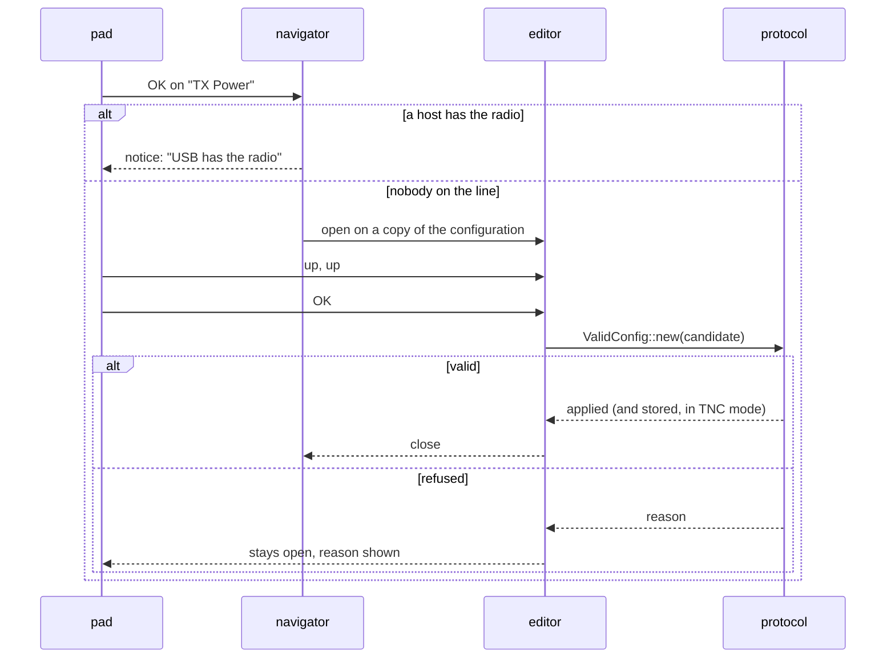

# The panel

The Super IO's 128 × 128 OLED and six-switch navigation pad give the board an
interface of its own. Five screens sit side by side; each has a menu of
actions; and the Radio screen's menu opens an editor for every parameter a
host can set.

## Getting around

| Switch | On a screen | In a menu | In an editor |
|---|---|---|---|
| left / right | previous / next screen | (ignored) | move the cursor (frequency only) |
| up / down | scroll the screen | move the highlight | step or change the value |
| OK | open the menu | pick the item | confirm |
| back | (nothing) | close the menu | cancel |

Held directions auto-repeat after 400 ms at eight steps a second. OK and back
do not repeat: an action chosen once is chosen once. A notice closes on any
key.

The bottom of every screen is a strip of five icons saying where you are; the
top is a title bar with the screen's name, the battery percentage on the left
and the board's name on the right: the four hex digits that end the name it
advertises, so two boards on a table can be told apart. A screen with more lines
than fit shows a scrollbar. The panel goes to sleep after a minute without a
gesture, and the next gesture wakes it (and is otherwise swallowed).

## The screens

**Home.** Which host has the line (`USB`, `Bluetooth`, or `none`), whether anything
has been said in the last ten seconds, what the radio is doing, packets in and
out, the last packet's RSSI and SNR, uptime, the battery, and what the charger
is doing (`charging`, `full`, `unplugged`, `fault`, `latched off`). The
battery reading is averaged over a few seconds and only moves when the cell
has, so it does not flicker between two numbers. Menu: *Sleep Screen*,
*Redraw*.

**Radio.** The current configuration, which is exactly what a host reads
back: frequency (and the frequency the chip is actually tuned to after the
reference correction), bandwidth, spreading factor, coding rate, power, the
bitrate they come to, preamble, sync word, CRC, header mode, IQ. Then what the
radio is *doing* with it: `off`, `receiving`, `refused` with the reason,
`failed`, or `no radio`. Menu: *Frequency*, *Bandwidth*, *Spread Factor*,
*Coding Rate*, *TX Power*, *Radio On/Off*, *Save Config*, *Reset Config*.

**Bluetooth.** Absent, advertising or connected; the advertised name; the
passkey while a pairing is in progress; how many phones are bonded, out of
four. Menu: *Forget Phones*.

**Position.** The GPS receiver's state (`off`, `no data`, `searching`, `fix`),
satellites used and in view, the age of the last fix, UTC time and date,
latitude, longitude and altitude. While the receiver is off the screen says
what turns it on. Menu: *GPS On/Off*.

**System.** oxinode's version and the RNode protocol version it speaks, the
device serial, the identity (`none`, `bad checksum`, `unsigned`, `signed`),
and free RAM. Menu: *Reboot*, *Bootloader*.

Every field that can be unknown shows a dash. A board that has heard nothing
shows `RSSI -`, not `RSSI 0 dBm`; one with no cell shows `Battery -`; the
Position screen never shows `0.000000` as a claim to be in the Gulf of Guinea.

## Editing a setting

The first five items of the Radio menu open an editor over the screen.
Bandwidth, spreading factor, coding rate and power are steppers: up and down
move through a fixed set, saturating at the ends. Frequency is a digit editor,
`MMM.kkk`, with left and right moving a cursor under one digit and up and down
changing it.

Confirming runs the candidate through the same validation a host's
configuration gets. A value the radio cannot do is **refused, not clamped**:
the editor stays open with the reason under the value, and nothing is applied.
Cancel leaves the previous value in place; nothing is applied until it is
confirmed.

## Who owns the radio

An RNode is host-controlled. Reticulum configures the radio once when it brings
the interface up, validates what came back, and never looks again: a parameter
that changed underneath it afterwards is a debug line in its log and nothing
else. So the rule is:

> **A live session on USB or Bluetooth owns the live radio configuration.**

A live session is DTR asserted on the KISS port, or a phone connected. While
one is there, any action that would change the radio (an edit, *Radio
On/Off*, *Reset Config*) opens a notice saying which host has it and does
nothing else. A terminal left open on the KISS port counts as a host, and the
notice says so.

With nobody on the line the panel is a controller, and the edit goes through
the same setters and validation a host gets. What the panel may do under a
host is what the host does not own: *Save Config* (store the live
configuration as the boot one, which is `CMD_CONF_SAVE` from the panel and
makes the board a TNC), *Forget Phones*, the screen, and the restarts.

## What survives a reboot

In TNC mode (a stored configuration exists) a confirmed edit goes into the
stored configuration as well as the live one, so it is what the board boots
with, and a reflash does not touch it. Under host control nothing is stored:
the host sets its configuration again on every connect, and a stored copy of a
panel edit would be a boot configuration nobody asked for.

The GPS receiver's on/off state is not stored. The mode switch is the
persistent default; a menu choice lasts until the next boot or the next move
of the switch. See [GPS](../hardware/gps.md).

## Looking at it without a board

Every screen, menu and editor renders on the host through the simulator, to a
PNG or in a terminal. See [The simulator](../development/simulator.md).
