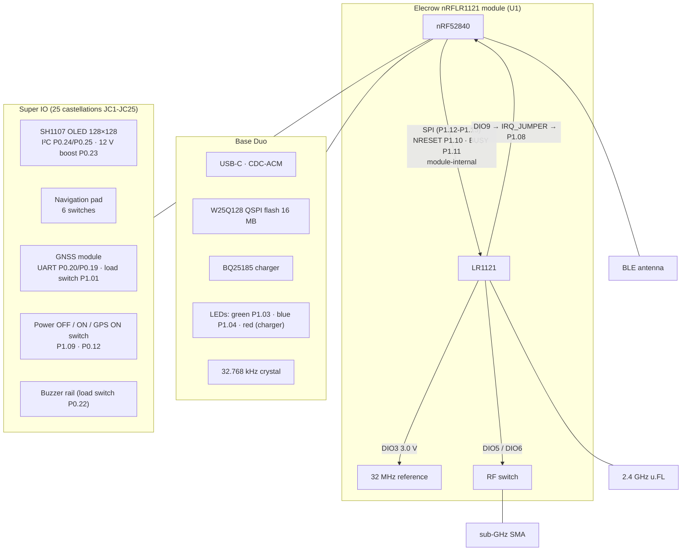

# The board

oxinode targets the muzi.works **Base Duo** with the **Super IO** expansion
board attached, as shipped: factory UF2 bootloader, S140 SoftDevice in flash,
Meshtastic replaced.

```
UF2 Bootloader 0.9.2-37-gf7fad14
Model: muzi Base
Board-ID: muzi-Base-Board
SoftDevice: S140 6.1.1
```

## One module, not two chips

The nRF52840 and the LR1121 are not two chips on the PCB. U1 is an **Elecrow
nRFLR1121**, an 80-pin 20 × 20 × 3.5 mm system-on-module containing both
dies, with the SPI link between them routed inside the module. Three
consequences run through the whole firmware:

- The nRF52840 GPIO numbers are fixed facts, not board choices. They terminate
  inside the module rather than on board copper.
- There is nothing to probe. No oscilloscope or logic analyser can see the SPI
  bus, NRESET or BUSY. Every radio failure has to be diagnosed from software,
  which is why the [bring-up image](../architecture/images.md) reports
  evidence for every step and why every wait on the chip is bounded.
- Exactly three LR1121 pins leave the module: `LR_DIO9`, `LR_DIO8` and
  `LR_DIO7`. The datasheet requires `LR_DIO9` to be jumpered to an MCU GPIO,
  and the Base Duo jumpers it to P1.08 over a net named `IRQ_JUMPER`. That is
  the interrupt line.

The module has a footprint-compatible sibling, the nRFLR1262 (nRF52840 +
SX1262), which is why Meshtastic's variant defines both `USE_SX1262` and
`USE_LR1121`. On that module the SX1262's IRQ surfaces on P1.06 instead. The
firmware reads the chip's identity at boot and expects an LR1121, which is
what this board's schematic populates.

Three separate antenna ports leave the module: `ANT_BLE`, `ANT_LORA_2.4G` and
`ANT_LoRa`. The sub-GHz LoRa path has an SMA connector; the 2.4 GHz path a
separate u.FL; Bluetooth has its own path and never contends with the LoRa
switch.



## Pin map

Read from the board's Meshtastic variant definition, cross-checked against the
Rev 01 schematic (`Base Duo [MH212A]`) and the module datasheet. Where the
schematic and the variant disagree, the schematic wins.

| Function | Pin(s) | Notes |
|---|---|---|
| LED green | P1.03 | **active low** |
| LED blue | P1.04 | active low |
| LR1121 IRQ | P1.08 | from the module's `LR_DIO9`, over `IRQ_JUMPER` |
| LR1121 NRESET | P1.10 | module-internal |
| LR1121 BUSY | P1.11 | module-internal |
| LR1121 SPI NSS / SCK / MOSI / MISO | P1.12 / P1.13 / P1.14 / P1.15 | module-internal; SPIM2 |
| LR1121 TCXO | — | 3.0 V via DIO3, which therefore cannot serve as an IRQ |
| LR1121 RF switch | — | the chip's own DIO5/DIO6, set by an on-chip command, not MCU GPIO |
| OLED I²C SDA / SCL | P0.24 / P0.25 | SH1107 at **0x3C**; 128 × 128, 1.12"; 5.1 kΩ pull-ups on board |
| OLED 12 V boost enable | P0.23 | must be driven **high** or the panel is dark |
| QSPI SCK / CS / IO0–3 | P0.03 / P0.26 / P0.30, P0.29, P0.28, P0.02 | W25Q128, 16 MB; not driven by oxinode |
| LF clock | — | external 32.768 kHz crystal (LFXO) |
| Navigation pad up / down / left / right | P0.21 / P0.17 / P1.05 / P0.16 | active low, internal pull-ups |
| Navigation pad OK / back | P0.10 / P0.15 | active low; **P0.10 is an NFC pin** |
| Power OFF / Power ON / GPS ON switch | P1.09 / P0.12 | P1.09 high in Power ON, P0.12 high in GPS ON, no pull; Power OFF cuts the board's power |
| GPS load switch (`GPS_EN`) | P1.01 | **active high**; gates the switched 3V3 rail the module lives on, 500 mA |
| GPS UART | P0.20 / P0.19 | the module transmits on **P0.20** (nRF52840 `RXD`) and receives on P0.19; 9600 baud, 8N1 |
| Battery sense | P0.31 (`AIN7`) | the cell through 806 kΩ / 1.5 MΩ, ratio 0.65048; SAADC at gain 1/6, 12-bit |
| Charger status | P1.02 | BQ25185 `STAT`, open drain, **low while charging**; internal pull-up |
| SWDIO / SWDCLK | — | test pads TP1 / TP2, no header |

Out of scope, recorded so nobody has to re-derive it: a second I²C bus on
P0.04/P0.06 carrying the IMU, an RX8130CE RTC at `0x32` and the Qwiic/STEMMA
QT connector (5.1 kΩ pull-ups on board), and the BQ25185 charger's fault
output on P0.27.

Everything above the Base Duo itself (pad, buzzer, GPS, OLED, mode switch)
lives on the Super IO and reaches it through 25 castellations carrying VBAT+,
a solar input, the two switched rails, the second I²C bus, the OLED bus and
eight general-purpose IOs.

## Things to be careful about

**Two pins are load-switch enables, not peripheral pins.** P1.01 (`GPS_EN`)
and P0.22 (`PIN_BUZZER`) each drive an NMOS that gates a high-side PMOS
feeding a switched 3V3 rail out to the expansion connector. Both are active
high, and P0.22 powers the buzzer rather than sounding it. 500 mA per switch,
600 mA total on the 3.3 V rail.

**The GPS UART is named from opposite ends in the two sources.** The
schematic labels P0.20 `UART_GPS_TX` (the net, from the module's side); the
variant declares `GPS_RX_PIN` P0.20 (the pin, from the MCU's side). They
agree: the module's TX arrives on P0.20. The firmware still probes both orders
rather than trusting either name. See [GPS](gps.md).

**It is a navigation pad, not a trackball.** Meshtastic declares
`HAS_TRACKBALL` and names the lines `TB_*`, but the Super IO has six discrete
switches. The pin numbers are the same either way; the driver is not. A
trackball emits a burst of edges and is read by counting them; a pad emits one
edge and then a level, and wants debouncing and auto-repeat. See
[Pad and mode switch](pad-and-switch.md).

**P0.10 is an NFC pin.** It carries the pad's OK switch and the user button
(SW1, active low, 100 kΩ pull-up). NFC pins only work as GPIO once the
`PROTECT` bit of `UICR.NFCPINS` is cleared, a non-volatile write. The firmware
builds `embassy-nrf` with `nfc-pins-as-gpio`, which clears the bit itself if
it is set (a single 1→0 word write, no page erase, `REGOUT0` untouched) and
resets once so it takes. On a board that shipped running Meshtastic the bit is
already clear and the write is a no-op. The product image logs both words at
every boot:

```
board: nav pad usable=true (UICR.NFCPINS), regulator=3.3 V
```

**The module is rated below the chip.** 20 dBm max sub-GHz and 11.5 dBm at
2.4 GHz, against the LR1121's headline 22/13 dBm. The firmware enforces the
module's numbers and refuses rather than clamping: a host that asks for
21 dBm is told no, because a silent clamp is a lie it cannot detect.

**The QSPI flash is 16 MB.** The variant declares a `W25Q32JVSS` (4 MB) and
the product page says 8 MB, but the Rev 01 schematic populates a
**W25Q128JVPIQ**. oxinode does not drive it.

**There is no DFU button.** The bootloader's `BUTTON_1` and `BUTTON_2` are
both P0.05, which is unconnected. Double-tap reset and the software path
(`GPREGRET`) are the only two ways into the bootloader.

**`UICR.REGOUT0` is already 3.3 V.** The bootloader programs it, so an
oxinode image inherits 3.3 V rather than the 1.8 V reset default. The panel's
boost converter and the QSPI flash expect 3.3 V, which is why nothing in the
firmware ever writes that word.

**The nRF52's TWIM locks up after a NACK, and lies rather than failing.** A
transaction that ends in an address NACK can leave the I²C peripheral in a
state it does not come out of, and `embassy-nrf` implements no workaround. It
produces plausible answers rather than errors: the same address answers a read
one moment and not the next. The display driver cycles the peripheral's
`ENABLE` register after any failure, and the bus scan does so after every
transaction. See [The display](display.md).

**The 1200-baud touch is state on the host.** macOS caches terminal settings
per device path and re-applies them, so a failed touch leaves the port at
1200 baud, and then anything that opens it, including `cat` reading the log,
performs another touch and sends the board back to its bootloader. The flash
script resets the cached rate after every flash, and the firmware ignores the
touch for the first two seconds after boot. Always open the ports at an
explicit baud rate.

**There are SWD pads.** No image assumes a debug probe and none is needed, but
SWDIO and SWDCLK come out to test pads TP1/TP2. If the no-probe constraint
ever becomes expensive enough, it is solderable rather than impossible.

**The red LED is the charger's.** It is wired to the BQ25185's status output,
not to the MCU. A red glow during bring-up means charging, not a fault.

## Battery

P0.31 reaches the cell through 806 kΩ over 1.5 MΩ, so the pin sees 0.65048 of
it: 4.2 V arrives as 2.73 V, inside the 3.6 V the SAADC measures at gain 1/6
against its 0.6 V reference. The arithmetic is in `oxinode_core::battery`,
pinned to those ADC settings, with the divider ratio checked against
Meshtastic's `ADC_MULTIPLIER` of 1.537 in a test. The percentage comes from an
eleven-point open-circuit table interpolated, because a straight line from
3.0 V to 4.2 V is twenty points wrong through the middle of a lithium cell's
curve. It is an estimate (a cell under load reads low, one on the charger
reads high), which is why the voltage is shown beside it. Below 2.5 V at the
cell the reading is reported as unknown rather than as a flat battery: with no
cell fitted the pin reads near zero.

The charger's `STAT` line on P1.02 is read with the chip's pull-up; low means
charging.

## Provenance

The hardware facts here were cross-checked against three sources, in
descending order of authority:

1. **The Base Duo Rev 01 schematic** (`Base Duo [MH212A]`, KiCad, from muzi
   works) together with Elecrow's nRFLR1121 and nRFLR1262 module datasheets.
2. **muzi works' fork of the Adafruit nRF52 bootloader**, MIT-licensed, whose
   `src/boards/muzi_base/` is the build the board reports running. This is
   where the UF2 family ids, the absent DFU button, the `REGOUT0` setting and
   the 40 KB reservation come from.
3. **The Meshtastic variant** (`variants/nrf52840/muzi_base/variant.h`),
   useful and mostly right, but wrong about the flash part and misleading
   about the load-switch pins and the trackball. Pin numbers and hardware
   facts are not copyrightable expression; none of Meshtastic's driver logic
   or comments are reproduced here.
