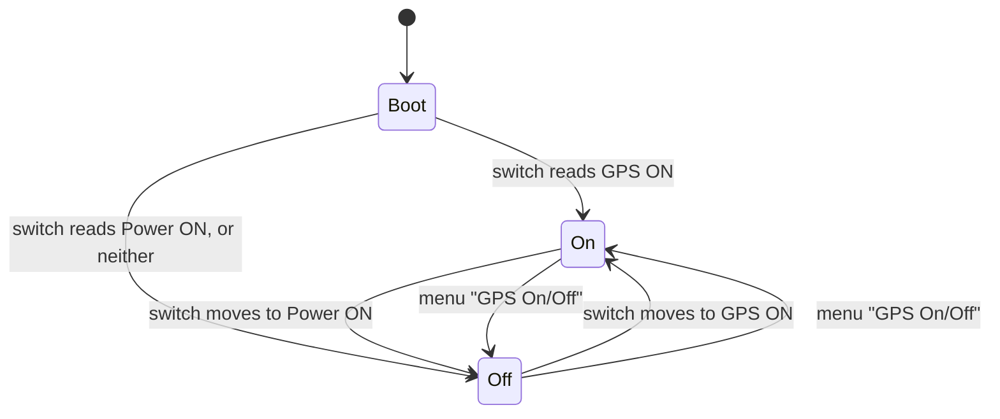

# GPS

The Super IO carries a GNSS module with a ceramic antenna, on a UART behind a
load switch. The firmware powers it, hears it, parses what it says on the
board, and shows the result on the Position screen. Nothing about the
position leaves the board: an RNode is a modem, and Reticulum has no notion of
a device's coordinates.

## Power is a load switch

P1.01 is not a module enable. It drives an NMOS that gates a high-side PMOS
feeding a switched 3V3 rail out to the expansion connector, rated 500 mA, and
the module hangs off that rail. Driving it high is what makes anything appear
on the UART.

Off is not merely the switch low. The receiver's output floats when its rail
is cut, and a UART left listening to a floating line burns current on the
input stage and fills the ring buffer with noise. So the UART driver is
dropped when the receiver goes off, which disconnects both pins, and built
again when it comes on. `oxinode::gps::Gps` owns the pins and peripherals
rather than a driver; the driver is a thing that exists while the module is
powered.

## The UART

The module transmits on **P0.20** (the nRF52840's `RXD`) and receives on
P0.19, at 9600 baud, 8N1. The two documentation sources name the pair from
opposite ends (the schematic names the net from the module's side, the
Meshtastic variant names the pin from the MCU's side), and the firmware trusts
neither: it opens the UART on the expected pins at 9600 baud, then 115200,
then 38400, then the same three with the pins swapped, listening three seconds
each, and stops at the first attempt on which a sentence with a good checksum
arrives.

```
0.239562 INFO  gps: power on (P1.01 high)
0.891387 INFO  gps: NMEA at 9600 baud, module TX on P0.20
```

The first attempt is the one, about 650 ms from rail to first sentence. The
probe stays in the product image because it costs nothing when the first
attempt is right, and a Super IO revision wired the other way would be a log
line rather than a silent screen.

The module is taken as it wakes: its default rate and sentence set. The MCU's
transmit pin is connected and idle. The buffered UART driver uses `TIMER2`,
`PPI_CH10`, `PPI_CH11` and `PPI_GROUP0` to count received bytes so the ring
can be read before a DMA transfer ends.

## Who decides whether it is on

The GPS is the largest continuous draw on the board, and the mode switch has
a position labelled GPS ON, so a physical control whose position can be seen
is where that decision lives.



- **At boot, the switch decides.** GPS ON powers the receiver; Power ON does
  not. A board with no Super IO (both lines floating) has no GPS to power and
  stays off.
- **When the switch moves, it decides again.** The task reads it every
  quarter second.
- **Between moves, the menu decides.** *GPS On/Off* on the Position screen
  flips the receiver regardless of where the switch is, and the switch,
  unmoved, does not flip it back. A switch caught mid-travel says nothing and
  changes nothing.

The rule is `oxinode_core::gps::Control`, twenty lines, every branch a test.
The receiver's state is not stored across a reboot; the switch is the
persistent default.

## NMEA, as much as the screen needs

The framing is `oxinode_core::gps::Lexer`, one byte at a time, and it is
unforgiving on purpose. A line whose checksum fails is dropped whole: a
corrupted digit in a latitude is a position a few hundred kilometres out,
which is worse than no position. A byte that cannot appear in a sentence
(which is what the wrong baud rate produces) abandons the line it was in. A
`$` mid-line starts over. A line past 82 characters is framing lost.

Three sentences are read by `oxinode_core::gps::parse`:

- **`GGA`** is the fix: time, quality, satellites used, latitude, longitude,
  altitude. Quality zero is no fix whatever the coordinate fields say.
- **`RMC`** carries the date, which `GGA` does not, and a second opinion on
  validity. Its coordinates are taken too, with `GGA`'s altitude kept, so a
  receiver that sends one and not the other still yields a fix.
- **`GSV`** carries how many satellites one constellation can see, which is
  the number worth watching before there is a fix. Each talker (`GP`, `GL`,
  `GB`, `GA`, `GQ`) reports its own view and the screen shows the sum.

Everything else (`GSA`, `GLL`, `VTG`, `TXT`, proprietary lines) is framed,
checked, and ignored. Coordinates are micro-degrees in an `i32` and altitude
is decimetres; nothing is floating point. The parser is tested against
captured sentences from a Quectel-class module through its first fix, a u-blox
line with four-place minutes, the southern and western hemispheres, a negative
altitude, and eighteen malformed bodies that frame correctly and are wrong
inside.

## What the receiver knows

`oxinode_core::gps::Receiver` folds sentences into a `Position`: status,
satellites used and in view, the last fix, its age, the time and the date. It
is timed from outside (every call carries the board's millisecond clock), so
its rules are testable at any speed:

- Powered and nothing readable for five seconds is `no data`. Talking with no
  fix is `searching`. A fix confirmed within the last five seconds is `fix`.
- **A lost fix is kept and aged.** A receiver that had a fix and stopped
  confirming it shows `searching`, the last coordinates, and the fix's age.
  A position a minute stale is still a position; the age is the honest part.
- **Power off forgets everything.** A position shown after the receiver was
  deliberately turned off is a claim nobody is standing behind. The module's
  own memory, not the firmware's, is what makes the next fix quick.

The firmware's part, `oxinode::gps::serve`, is a task beside the Bluetooth
one. It owns the load switch and the UART, runs the probe, feeds bytes to the
receiver, and publishes the `Position` into a mutex the modem loop copies out
once per redraw. The two meet nowhere else except the menu item, which raises
a signal. Nothing on the radio's path waits for the receiver.

## The screen

```
GPS              fix
Sats            7/11
Fix age          3 s
UTC         13:47:09
Date      2026-09-08
Lat        47.376887
Lon         8.541694
Alt          408.0 m
```

Every value is a dash until it is known. A receiver that is off shows `off`,
seven dashes, and a line saying the switch or the menu turns it on. The
widest a coordinate can be, `-180.000000`, fits its row, and a test says so.

## Not measured

The receiver's current draw. It can be turned off from the menu and the
switch, and the UART is released when it is, so both halves of the
measurement are one reading away from anyone with a meter in the battery
lead.
