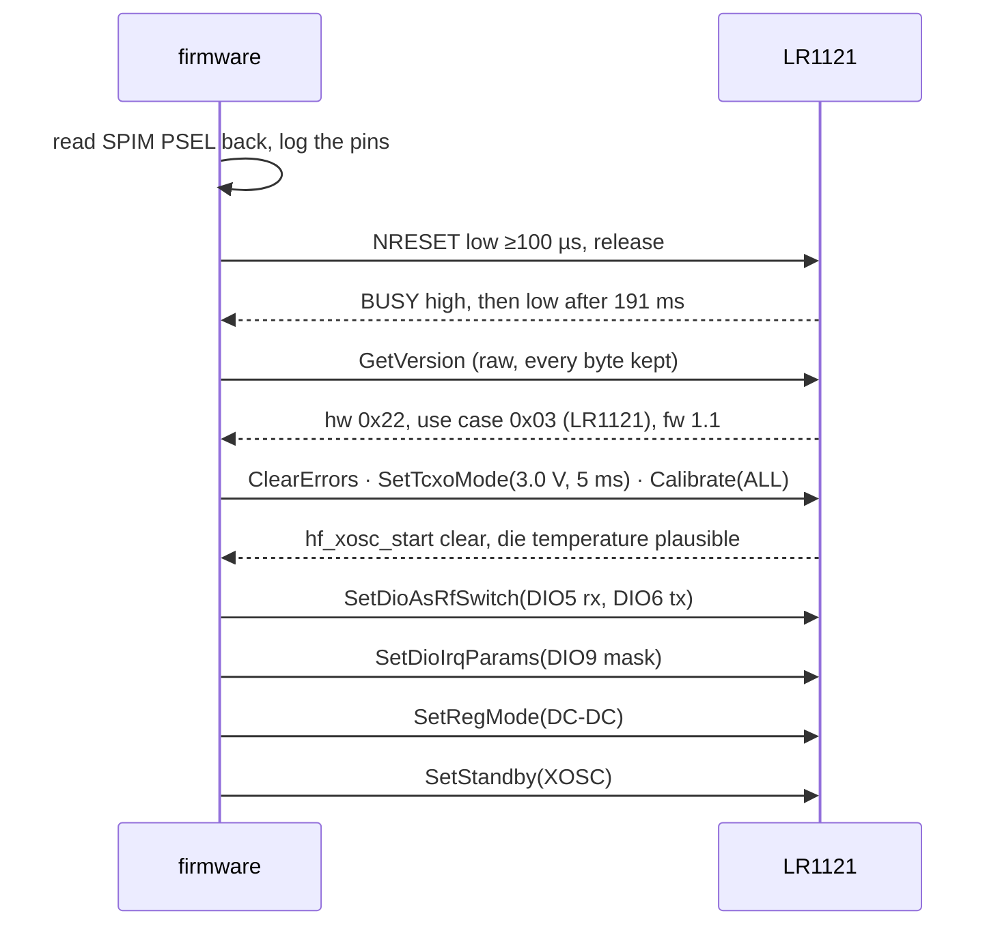

# The radio

The LR1121 is driven over SPI through the `lr11xx` crate's low-level API.
Everything decidable without the chip (encodings, conversions, the airtime
formula, the reference correction, the carrier-sense decision) lives in
`oxinode_core::lr1121` and is unit tested on the host. This page is about the
chip and the module: what they do, what they are rated for, and the behaviour
that was measured rather than assumed.

## Why `lr11xx`'s low-level API and not `lora-phy`

`lr11xx` 0.1 implements `lora-phy`'s `RadioKind`, but eight of its methods,
including everything a transmission needs, are `todo!()` and panic. The same
crate's low-level API is complete, and an RNode wants raw LoRa PHY rather than
LoRaWAN. So oxinode talks to `lr11xx` directly and keeps its own thin layer on
top. `lora-phy` and `defmt` are mandatory dependencies of `lr11xx` with no
feature to switch them off; LTO drops the unused half.

## Bring-up

The bring-up sequence is in `src/bringup.rs` and runs in every image with a
radio. Each step is there because it produces evidence, and each is bounded,
because with no probe a hang and a crash look identical.

**SPI.** SPIM2 on SCK P1.13, MOSI P1.14, MISO P1.15, with CS P1.12 driven as
a GPIO through `embedded-hal-bus`'s `ExclusiveDevice`. Mode 0, MSB first,
1 MHz. Not SPIM3: it is the fast instance and also the one carrying an EasyDMA
anomaly that `embassy-nrf` does not work around, and at 1 MHz its speed buys
nothing. The over-read character is `0x00` because `lr11xx` requires MOSI held
low during a read. The SPIM's own `PSEL` registers are read back and logged,
which catches a transposed `miso`/`mosi` without the chip's help.

**Reset takes 191 ms.** The SX126x family trains you to expect milliseconds;
this part takes 191.1 ms from NRESET release to BUSY falling, deterministic to
within two ticks of the 32.768 kHz crystal across repeated resets. The number
is `STARTUP_MEASURED_US` in the core, the timeout is five times it, and a
compile-time assertion stops anyone quietly reverting it. BUSY is sampled
before NRESET is touched, so the trace confirms both pins at once: a GPIO that
was not NRESET would not move a pin that was not BUSY. `wait_for_low()`
returns immediately on a pin stuck low, so a bare "did BUSY fall" check
reports success loudest exactly when it is most wrong; the verdict is read
from a trace instead.

**The version probe is raw.** `lr11xx`'s own `version()` validates the reply
and discards the bytes on failure, at exactly the moment the bytes are the
only evidence there is. The first transaction is issued by hand and every byte
kept. The command and its reply are separate NSS cycles with BUSY high in
between; done in one transaction you get the status of the previous command
and no reply at all. `lr11xx` waits for BUSY with no timeout of its own, so
the bounded probe goes first and the crate is only handed the pins once BUSY
has proved itself.

**The reference oscillator.** `SetTcxoMode` with tune 3.0 V and a delay of
164 steps (5005 µs, in 30.52 µs units; the conversion is in
`oxinode_core::lr1121::tcxo` with tests, because rounding it down is the one
mistake that produces `HF_XOSC_START_ERR`). Without the command the oscillator
does not start at all, so there is a real external clock and telling the chip
about it is right. The delay is a fixed wait, not a timeout: it is charged to
the first operation that needs the oscillator, which is why the modem idles in
**standby XOSC** rather than standby RC. Idling in RC would pay 5 ms on every
packet, a tenth of the airtime at SF7. The calibrations that ran at power-on
did so without a working 32 MHz clock, so `Calibrate(ALL)` is redone after the
oscillator is up. `GetTemp` is a real test of the oscillator rather than a
formality: before `SetTcxoMode` it returns a number computed from a clock that
is not running, so "is this a plausible temperature" is a direct check.

**The RF switch.** The chip's own DIO5 and DIO6 drive the antenna switch.

| Mode | DIO5 | DIO6 |
|---|---|---|
| standby | low | low |
| RX | **high** | low |
| TX / TX high power | low | **high** |
| TX high frequency (2.4 GHz), GNSS, WiFi | low | low |

The 2.4 GHz row is the same as standby because that path does not go through
this switch: it has its own u.FL connector. The table packs to
`0x0300_0102_0200_0000` in `oxinode_core::lr1121::rf_switch`, with tests that
pin every byte, and is passed as a raw word because `lr11xx`'s builder has no
field for the high-frequency TX state. A wrong switch configuration produces a
clean `TxDone` while nothing reaches the antenna, so the masks were proved on
an SDR: 31 dB of commanded carrier range produced 29.3 dB of measured range at
one frequency to within 0.6 kHz.

**Interrupts.** DIO9 reaches P1.08. The mask routes what ends an operation or
reports a fault (`TxDone`, `RxDone`, `Timeout`, `CadDone`, `Error`,
`CmdError`) and deliberately omits `preamble_detected`,
`sync_word_header_valid` and `cad_detected`, which fire constantly on a busy
band and would wake the MCU for events it can do nothing about. DIO11 does not
leave the module, so its mask is empty, asserted at compile time. The line was
proved by raising `cmd_error` deliberately and watching P1.08 rise and fall
again when the interrupt was cleared, and by repeating that with an empty mask
and watching it stay low.

**The regulator.** `SetRegMode` selects the DC-DC converter rather than LDO
mode. Measured by die temperature over repeated carriers, LDO dissipates about
2.3× as much for the same output power. `SetRegMode` only works in standby RC;
in any other mode the chip accepts it and reports `CMD_FAIL` on the next
status read, so the mode is forced first and the result read back.

## Two habits that are not optional

The LR11xx protocol returns the status of the *previous* command from every
call, so a driver returning `Ok` has told you about the command before the one
you care about. Every sequence in the modem therefore ends by asking for a
status. And several commands persist across experiments until the chip is
rebooted, so once one attempt succeeds every later one succeeds for the wrong
reason; the bring-up image's `r` command reboots the radio for exactly this.

Three commands report success and do nothing if issued in the wrong mode:

- `SetTxCw` refuses without `SetPacketType`, latching `cmd_error` while
  `GetErrors` stays clean.
- `SetRegMode` outside standby RC.
- The configuration commands from receive: the first configuration after boot
  works and every one after it silently keeps the old settings. The modem
  returns the chip to standby before every reconfiguration.

## Ratings and units

| | value |
|---|---|
| Band | 902–928 MHz (US915) on the SMA, in every image; 2400–2483.5 MHz on the u.FL, in the `radio` image only — see [The 2.4 GHz path](#the-24-ghz-path) |
| Maximum power | **20 dBm** sub-GHz, **11 dBm** at 2.4 GHz (the module's ratings, 20 and 11.5, rounded down, below the chip's 22/13) |
| Spreading factor | 5–12 at the chip; 7–12 representable on the RNode protocol |
| Bandwidth | the chip's set for the band: 62.5/125/250/500 kHz sub-GHz, 203.125/406.25/812.5 kHz at 2.4 GHz. Refused for the six of the ten RNode bandwidths it does not have, and refused as *the other band's* for the right set on the wrong band |
| Coding rate | 4/5 to 4/8; the host's 5–8 is translated to the chip's 1–4 |
| Sync word | `0x12` (private) by default; `0x34` would announce LoRaWAN, and `0x2b` is Meshtastic's |

The host's coding rate is the denominator of 4/n. Passing it straight through
does not produce an error; it selects the long interleaver at the wrong rate,
and the radio transmits happily while nothing hears it. The translation is
tested in both directions.

The PA selection prefers the low-power PA throughout its range, including the
−9 to +14 dBm it shares with the high-power one, because it draws less and is
the only one that has ever been measured on this board. Above 14 dBm the
internal regulator cannot supply the PA, so the high-power PA is switched to
VBAT at exactly that boundary. Getting this wrong is not an error the chip
reports; it is a brown-out.

## The 73 ppm reference error

The module's 32 MHz reference runs **73.3 ± 0.5 ppm low**. At 915 MHz that is
67 kHz, over half a 125 kHz LoRa channel.

That number was measured on an SDR by chopping between two carriers inside a
single capture, which separates the transmitter's clock error from the
receiver's (the RTL-SDR's own error came out at −1.4 ppm). It is not the TCXO
tune voltage (all eight codes start the oscillator and the frequency does not
care) and not a crystal driven in the wrong mode (without `SetTcxoMode` the
oscillator does not start). What is left is the module's own reference, which
also drifts about 0.65 ppm/°C, roughly twenty times a TCXO's stability. And it
is a property of the module rather than of one board: sweeping the receive
frequency against a second Base Duo gives a reception window symmetric about
zero, so both carry the same error.

So the correction is arithmetic in `oxinode_core::lr1121::reference`, as an
integer in tenths of a ppm, first-order (`f × (1 + p)`, which differs from the
exact form by 5 Hz at 915 MHz against a 460 Hz measurement uncertainty).
Compile-time assertions check that correcting 902, 915 and 928 MHz and then
applying the measured error lands back within 100 Hz. Turning the correction
on moves the receive window's edge against the peer board by −74 ± 14 kHz
against −66.5 kHz predicted.

**Whether to apply it is a configuration field, not a constant.** Corrected,
the board is right in absolute terms and 73 ppm away from every other
nRFLR1121, including one on the bench next to it. Uncorrected, it is wrong in
absolute terms and agrees with them exactly. The default is corrected, because
an RNode's peers are other RNodes. The `radio` image's `R` key toggles it.

The consequence for the protocol is that the **commanded** frequency is 73 ppm
above the **wanted** one, and Reticulum rejects a frequency that comes back
more than 100 Hz from what it set. The protocol reports the wanted frequency;
the Radio screen shows both.

## The 2.4 GHz path

The LR1121 has a second front end: a high-frequency transceiver for
2400–2500 MHz with its own PA, its own bandwidths and its own pin, which the
module brings to a u.FL connector next to the sub-GHz SMA and rates at
11.5 dBm. It does not go through the RF switch (the `TX high frequency` row
of the table above is the same as standby for that reason), and it is
different silicon from the sub-GHz path in every respect that the firmware
has to know about:

| | sub-GHz | 2.4 GHz |
|---|---|---|
| Band, as validated | 902–928 MHz | 2400–2483.5 MHz (the regulatory edge, not the chip's 2500) |
| PA | low-power (`PaSel` 0) to 14 dBm, high-power (`PaSel` 1) above | high-frequency (`PaSel` 2), internal regulator only, −18 to +13 dBm at the die |
| Module rating | 20 dBm | 11.5 dBm; the firmware holds 11 |
| Bandwidths (chip codes) | 62.5 / 125 / 250 / 500 kHz (`0x03`–`0x06`) | 203.125 / 406.25 / 812.5 kHz (`0x0D`–`0x0F`) |
| Image calibration | `CalibImage` on the band | none: the command's two one-byte arguments are in 4 MHz steps and cannot name 2.4 GHz, and `lr11xx` documents it as acting on the sub-GHz input |
| Connector | SMA | u.FL |

So a configuration has a band before it has anything else, and
`oxinode_core::lr1121::config` decides it from the frequency and judges the
bandwidth and the power against that band's tables. A 125 kHz bandwidth at
2478 MHz is refused as *bandwidth belongs to the other band* rather than as
unsupported, because the chip does have it, just not there; 14 dBm at
2478 MHz is refused as above the module's 11 dBm rating at 2.4 GHz, a
different message from the sub-GHz 20 dBm one because it is a different
number. Every one of those rules has a test.

`lr11xx`'s `LoRaBandwidth` has no variant for the three 2.4 GHz codes, so the
modulation word is packed in core from the tested codes and handed to the
crate as a raw value, the same way the RF switch and PA words already are.

**Which images drive it.** The bench image, on purpose, and the product image,
not yet. Validation takes a `Bands`: the `radio` image asks for both and its
`H` key loads `BENCH_2G4` (2478 MHz, 812.5 kHz, SF8, CR 4/5, 11 dBm,
uncorrected); the product image asks for the sub-GHz band alone, so a host
setting 2.4 GHz on it is told what it would be told for 868 MHz. Extending the
product is [#43](https://github.com/paulmeier/oxinode/issues/43), and it is
more than changing what it asks for: the panel's frequency editor, bandwidth
steps and power steps are all sub-GHz.

2478 MHz rather than the middle of the band because the middle of this band
is somebody's Wi-Fi: it sits above channel 11's top edge, under the band's,
and 2 MHz clear of Bluetooth's advertising channel 39 at 2480, with room for
the widest LoRa bandwidth. Uncorrected because the only radio that answers
on 2.4 GHz is another Base Duo carrying the same 73 ppm error — which is
181 kHz up here, still inside an 812.5 kHz channel either way.

**Whether a host can ask for it** — question 2 of
[#35](https://github.com/paulmeier/oxinode/issues/35) — has a plain answer
from the Reticulum source (RNS 1.5.0). `RNodeInterface` validates the
frequency against 137 MHz–3 GHz, the bandwidth against 7.8 kHz–1.625 MHz,
the power against 0–37 dBm and the spreading factor against 5–12, sends the
frequency as four bytes, and compares what the radio reports against what it
set to within 100 Hz. Nothing in it knows what a band is. So `frequency =
2478000000`, `bandwidth = 812500`, `txpower = 11` is an ordinary interface
configuration, and the firmware's own validation is the only thing standing
between it and the air. `rnodeconf` is the one place a band is named, and it
names it from its own table keyed on the model byte, for `-i` and for
choosing a firmware file; that table has one 2.4 GHz entry (`0xAC`, a T3S3
with an SX1280 and a PA, 2.4–2.5 GHz, 20 dBm) and lists the dual-radio
RAK4631 models by their sub-GHz range only. Model `0xff` has no entry, so
`rnodeconf -i` says the band is unknown, which is not wrong. What to tell the
host about a board with two bands is
[#45](https://github.com/paulmeier/oxinode/issues/45).

**What has been checked on a board, and what has not.** The path's silicon
facts above are the datasheet's and the crate's; the switch and PA words are
built and tested in core. Checking the path on the bench is a `radio` image
on each of two boards, `H` on both, `y` on one and `p` on the other, and
then the other way round; the result is recorded on
[#35](https://github.com/paulmeier/oxinode/issues/35). What that exchange
does not establish is that the path is *right*: the RSSI calibration table
the chip boots with is the sub-GHz one, the receive-boost setting is a
sub-GHz setting, and the RTL-SDR that measured everything on this page stops
at 1.7 GHz, so nothing has measured what leaves the u.FL. That is
[#44](https://github.com/paulmeier/oxinode/issues/44).

## Airtime

Airtime is computed from Semtech's formula in `oxinode_core::lr1121::lora`,
hand-checked in a test that shows its working. Measured `TxDone` exceeds
computed airtime by a constant 437–461 µs across a 3.5× range of
configurations (the `SetTx` transaction, PLL lock and PA ramp). A wrong formula
would scale; a wrong coding-rate translation would move between rows. Neither
does, and the modem uses the prediction to detect a `TxDone` that arrives at
the wrong time. The chip's transmit timeout saturates at the field's 24-bit
width rather than wrapping; three airtimes at SF12 and 62.5 kHz is over eight
minutes and does not fit.

## The bring-up image

`radio` walks the whole sequence above, reports the evidence for every step,
and then offers a single-character console on its serial port for carriers,
test packets, receive sweeps and a radio reboot. See
[Firmware images](../architecture/images.md) for the key table.

!!! danger "Before transmitting"
    Attach an antenna to the connector of the band you are on: the SMA for
    sub-GHz, the u.FL for the `H` preset. The sub-GHz antenna is not on the
    2.4 GHz path and the log says so when that preset is loaded. Transmitting
    into an open port can damage the PA. Start at the lowest usable power and
    stay within the module's 20 dBm sub-GHz and 11 dBm at 2.4 GHz. Every
    carrier stops itself after ten seconds: an unmodulated carrier is a bench
    diagnostic, not a mode that satisfies FCC Part 15.247 in 902–928 MHz.

## Open observations

- The chip reports its last reset as `Analog` (power-on or brown-out) rather
  than `External` after a pulse on NRESET. Both the raw probe and `lr11xx`
  agree on the byte. Recorded, not resolved.
- Two nominally identical receive sweeps with the correction off both dip at
  +220 and +240 kHz in the middle of a full passband, consistent with a
  fixed-frequency spur. Recorded, not established.
