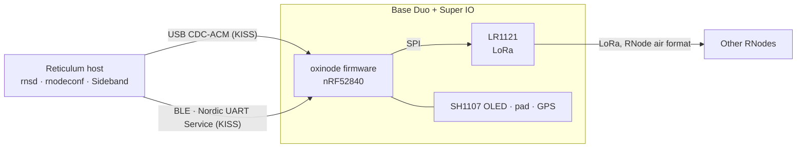

# oxinode

RNode-compatible LoRa modem firmware in Rust for the
[muzi.works](https://muzi.works) **Base Duo** (Nordic nRF52840 + Semtech
LR1121) with the Super IO expansion board attached.

A host running [Reticulum](https://reticulum.network/) sees the board as an
ordinary RNode over USB serial or Bluetooth LE. No custom interface driver, no
patched Reticulum: `rnsd` opens the port, `rnodeconf` provisions it, and
[Sideband](https://unsigned.io/sideband/) pairs with it. The Super IO's OLED
and navigation pad give the board an interface of its own, so it can be looked
at and configured with no host attached. It replaces the Meshtastic firmware
the board ships with.

## What it does

- **RNode over USB.** The KISS-framed RNode command set on the first USB
  serial port, with the firmware's log on the second. Unmodified `rnsd` brings
  the interface up and passes packets.
- **RNode over Bluetooth LE.** The same byte stream over the Nordic UART
  Service, with passkey pairing shown on the OLED, bonds stored in flash, and
  USB still working alongside.
- **Provisioning that survives a reflash.** `rnodeconf` writes an EEPROM
  image, signs the device, and stores a configuration the board boots on by
  itself (TNC mode). The record lives in flash the bootloader never touches.
- **A stock RNode's air format.** One header byte per LoRa frame, packets
  over 254 bytes split into two frames and reassembled, and carrier sense with
  random backoff before every transmission, spent in receive so nothing is
  missed while waiting.
- **A runtime-configurable radio, validated before it reaches the chip.**
  Frequency, bandwidth, spreading factor, coding rate and power are values a
  host sets, checked against what the module can actually do, and refused
  rather than clamped. The module's 73 ppm reference error is corrected in
  arithmetic.
- **An on-device interface.** Five screens on the 128 × 128 OLED, driven by
  the six-switch navigation pad: Home, Radio, Bluetooth, Position, System.
  Every radio parameter is editable from the panel when no host has the
  radio; every screen shows a dash where it knows nothing.
- **GPS.** The Super IO's GNSS module, powered through its load switch,
  parsed on the board, and shown on the Position screen. The receiver follows
  the mode switch and the menu.
- **A simulator.** The interface is pure code and renders on the host: any
  screen to a PNG, the menus in a terminal, and every screen and menu item
  held to a committed golden image at two panel sizes.

## Where to start

| If you want to… | Read |
|---|---|
| Put the firmware on a board | [Flashing](getting-started/flashing.md) |
| Use it with `rnsd`, `rnodeconf` or Sideband | [Using it with Reticulum](getting-started/reticulum.md) |
| Drive it from the pad and the OLED | [The panel](getting-started/panel.md) |
| Know what the board is and which pin does what | [The board](hardware/board.md) |
| Understand how the code is put together | [Architecture overview](architecture/overview.md) |
| Build, test and change it | [Local setup](development/setup.md) and [Contributing](development/contributing.md) |
| Know what it does not do yet | [Known limitations](reference/limitations.md) |

## The shape of the project

Three crates share the work. `oxinode-core` holds everything decidable without
a peripheral and is unit tested on the host; `monopanel` is the on-device
interface as a crate with nothing of oxinode in it; the firmware crate wraps
those around `embassy-nrf` and the hardware. `oxinode-sim` renders the
interface on the host. See the [overview](architecture/overview.md).

## License

oxinode is released under the [Reticulum License](license.md), the license
Reticulum itself uses. The RNode protocol is implemented from Reticulum's host
side as a clean-room reimplementation; nothing from the GPL-licensed reference
firmware or from Meshtastic is copied. The one non-free component is Nordic's
SoftDevice Controller, a binary licensed for use on Nordic silicon.
